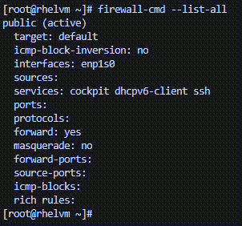
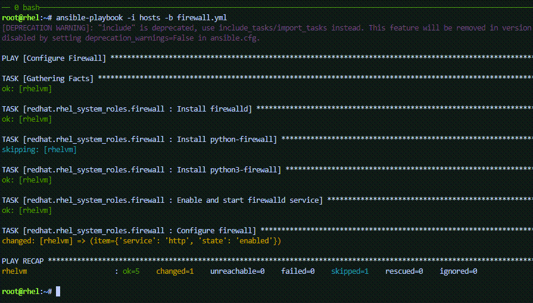
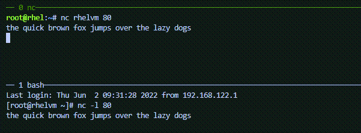
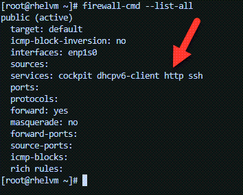

In this challenge, we will enable access to the http port 80 on `rhelvm`.

First, we'll prove to ourselves that port 80 is blocked by the firewall running on `rhelvm`.

Switch to the `rhelvm` terminal by clicking on the rhelvm tab.


Run the following in `rhelvm`.

```bash
firewall-cmd --list-all
```



The output above shows that port 80 is not open.

In the `rhelvm` terminal, run `nc -l 80`. This command runs the utility `netcat` and tells it to listen for incoming traffic on port 80.

```bash
nc -l 80
```


`netcat` is now listening on port 80 on `rhelvm`. __***Do not exit out of `nc` in this terminal!***__

Switch back to the `rhel` terminal.

Enter the command `nc rhelvm 80`. This tells `netcat` to connect to port 80 on `rhelvm`.

```bash
nc rhelvm 80
```


`netcat` cannot connect to `rhelvm` on port 80.

Let's use RHEL systems roles to open up port 80 on `rhelvm`.

First, Ansible requires a host file pointing at the `rhelvm` host. The host file looks like this.

<pre>
all:
  hosts:
    rhelvm:
  vars:
    firewall:
      - service: http
        state: enabled
</pre>

Copy and paste the following into the `rhel` terminal.

```bash
tee -a /root/hosts << EOF
all:
  hosts:
    rhelvm:
  vars:
    firewall:
      - service: http
        state: enabled
EOF
```

Remember to type `enter`.

Next, we'll create a simple Ansible playbook that tells ansible to apply the RHEL Firewall system role.

<pre>
- name: Configure Firewall
  hosts: all
  roles:
    - redhat.rhel_system_roles.firewall
</pre>

Copy paste and run the following in the CLI.

```bash
tee -a /root/firewall.yml <<EOF
- name: Configure Firewall
  hosts: all
  roles:
    - redhat.rhel_system_roles.firewall
EOF
```

Now we'll apply the system role to `rhelvm` by running the following command on `rhel`.

```bash
ansible-playbook -i hosts -b firewall.yml
```



Run `nc rhelvm 80` in the `rhel` terminal again.

```bash
nc rhelvm 80
```

We'll type something into the terminal and hit enter. You should see it printed out in the `rhelvm` terminal.



Exit out of `nc` in the `rhel` terminal by typing `ctrl-c`. This will cause `nc` to exit in `rhelvm`.

Finally, we'll use `firewall-cmd` to list the open ports on `rhelvm`. Switch to the `rhelvm` terminal and type the following command.

```bash
firewall-cmd --list-all
```


