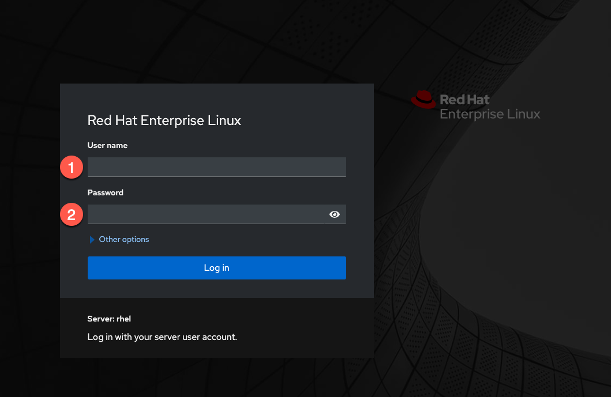
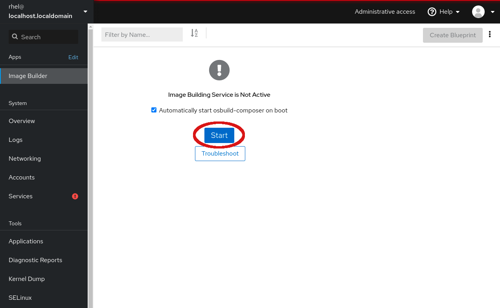

## Log in to the Web Console

Click on the tab titled **RHEL Web Console** at the top of  your lab system interface. Selecting this tab will open the lab system's Web Console in a
new browser tab or window.

Click `Advanced`

Then click `Proceed to rhel.xxxx.instruqt.io`

Once the login page is presented, use the following credentials to log into the Web Console:

Username: **rhel**\
Password: **redhat**

Now that you are logged into the Web Console, we must turn on administrative access.

Click `Turn on administrative access`.

Next do the following:

1) Enter the password: **redhat**
2) Click `Authenticate`

## Navigate to Image Builder application

After logging into the Web Console, you'll be looking at the Overview tab. Navigate to the Image Builder tab, as shown below:

Because you have not used Image Builder before, you will need to start the back-end service by clicking the *Start* button. Notice that the *Automatically start osbuild-composer on boot* is selected, which means the service will automatically start after this whenever the system is booted.

Now that the back-end service has been started, you will notice that the application screen updates and you can now *Create Blueprint*, which is what you will do on the next step.
