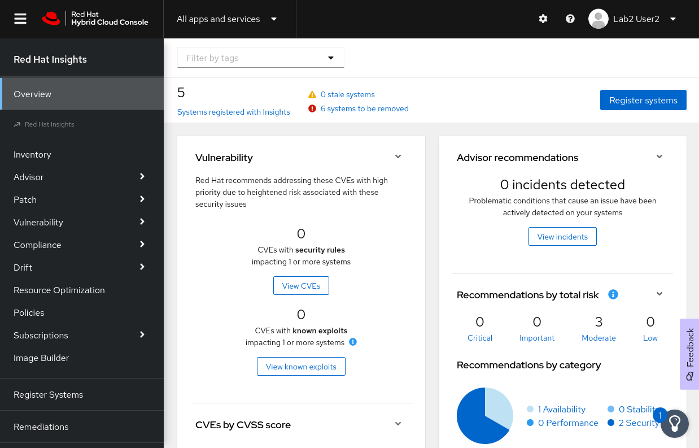
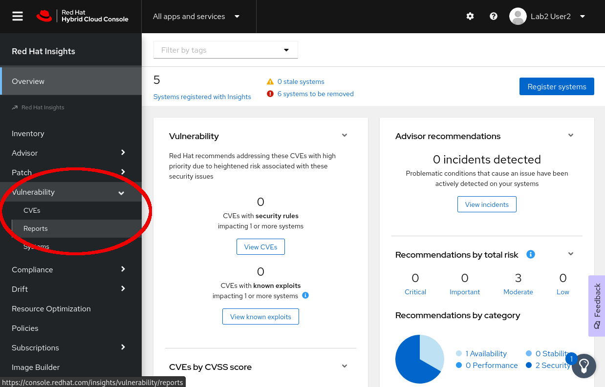

# Navigating the Insights service

Now that you have opened Red Hat Insights for Red Hat Enterprise Linux, you
will see a summary dashboard of all systems registered to your organization.

For this exercise we are going to generate a report that tells us where our fleet of systems sits in regards to un-remedieated vulnerabilities.  From the Insights dashboard, you should navigate to Vulnerability -> Reports on the left-hand side menu.

Once you are on the Reports page, click on Create Report under Report by CVEs, you will be prompted to enter a report title, and filter criteria.  For now let's leave the report title as is, and select severities of Critical and Important.  Leave the rest of the form at the defaults, and press export report.

This will generate a report, and then let you download it (or open it in your browser depending on your browser).  This report will give you a detailed view of what CVEs are un-patched in your environment, and the number of systems which are impacted by each.

This report is great prep for your annual compliance audit, because it displays a summary of the industry standard CVE ID, along with other information to help you or your team assess the threat that each vulnerability poses.

