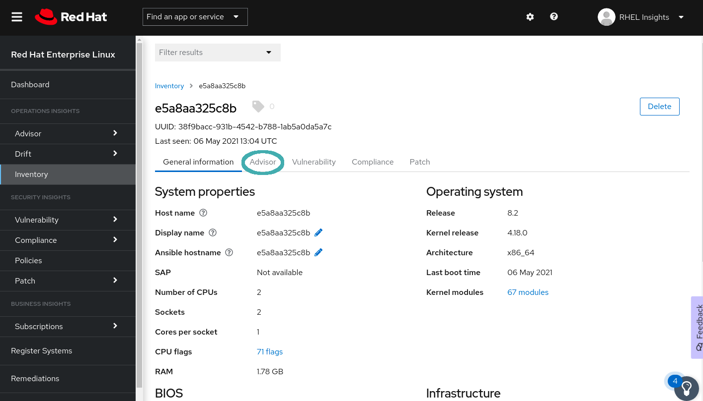
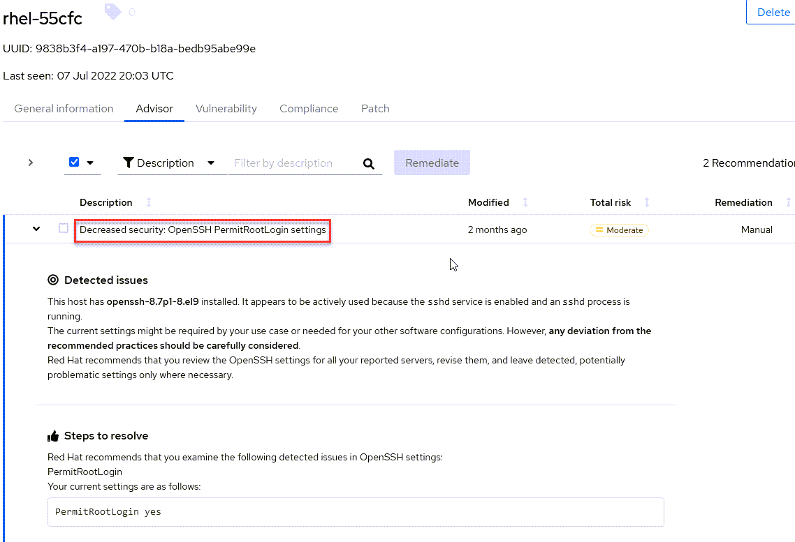
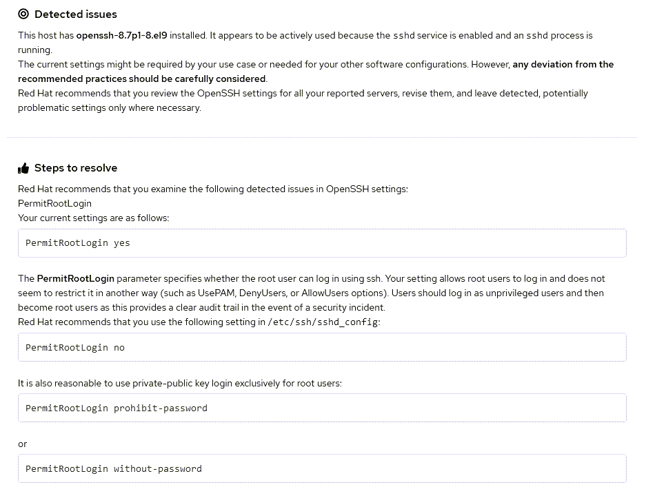

# Finding affected systems

After proving the report generated in the previous step to your auditors, they have asked you to find, and fix any vulnerability classified as Important or Critical.  For the purposes of this lab, we will perform these tasks on just our lab host.  To find CVEs on our host that match this criteria, browse to Inventory on the menu to the left, and find the host that matches the hostname you recorded in Step 1. Click on it, and then select the Vulnerabilty heading within the host information pane.  



You should see a list of any vulnerability that is impacting this host, but we want to filter these by severity.  Inights makes this simple.  You will see a filter option at the top of the list of vulnerabilities, in the drop-down list select Severity. 



And then in the Filter by severity drop-down, check off both Critical, and Important. The list of CVE's should automatically filter down to just Critical and Important vulnerabilities. 



From this list of vulnerabilities, you can create a remediation playbook for any, or all, of the CVEs.  Or you can view their security advisory, and remediate manually.  With a smart management subscription, you can even launch a remote job to remediate the issue right from this console.  

For now, let's just update the packages related to one of the CVE's in the list.  Keep your insights web browser open, and in the console for our host issue the following command.

```
dnf update --cve CVE-2022-2526
```
