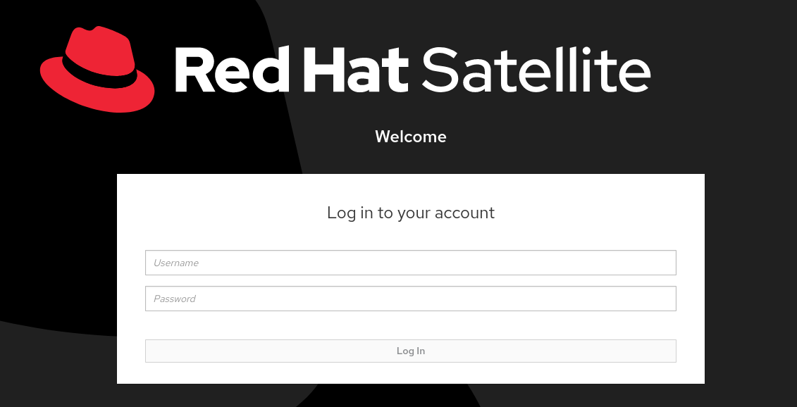
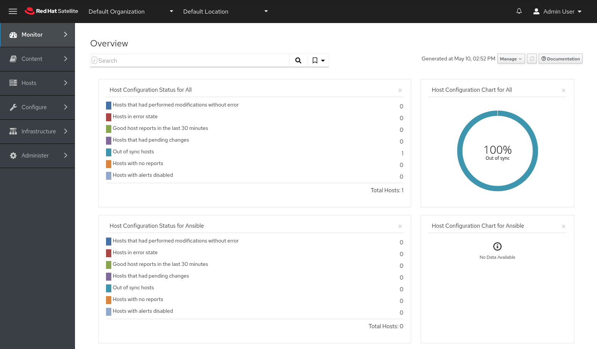

Lab Environment
===============

The lab environment consists of the following:

- Red Hat Satellite 6.13 Server (Satellite is preinstalled)

Log into the Web UI
===================

First, we'll log into the Red Hat Satellite Web User Interface (UI). Satellite has been preinstalled and installation is out of scope for this lab.

Click on the tab labelled Satellite Web UI as shown in the image below.

 

You'll need the following credentials to log into the Satellite Web UI.

You can copy and paste each of them below.

```bash
admin
```

```bash
bc31c9a6-9ff0-11ec-9587-00155d1b0702
```

Now click `Log In`.



You will be taken to the main dashboard.  
Depending on if you log in with Mozilla Firefox or a Chrome-based browser, the order of widgets may be different.

