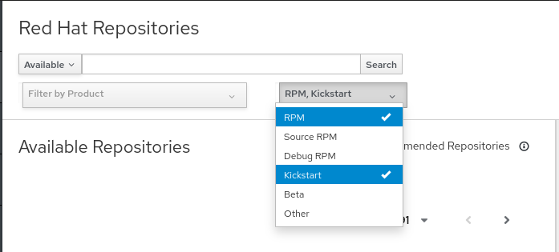

<!-- markdownlint-disable MD033 -->
Enable Red Hat repositories
===========================

1. Navigate to the Red Hat Repositories page by hovering over `Content` and clicking on `Red Hat Repositories`.

     Red Hat Repositories" src="../assets/content_redhatrepositories.png" />

    The Red Hat Repositories menu will provide a list of available repositories. You can choose to synchronize whatever you want. In this lab we'll synchronize the `BaseOS` and `AppStream` repos for RHEL 9 including the kickstart repos.

    Red Hat Enterprise Linux 9 is distributed through two main repositories:

    * BaseOS
    * AppStream

    Both repositories are required for a basic RHEL installation, and are available with all RHEL subscriptions.

    Content in the BaseOS repository provides the core set of the underlying OS functionality that provides the foundation for all installations. This content is available in the RPM format and is subject to support terms similar to those in previous releases of RHEL. For more information, see the Scope of Coverage Details document.

    Content in the AppStream repository includes additional user-space applications, runtime languages, and databases in support of the varied workloads and use cases.

1. First, lets change the filter to show the kickstart repos as well. Click the filter and click `Kickstart` to add it to the list.  
    

1. Next, lets filter the list to make it easier to find items. Enter `rhel-9 x86_64 baseos` in to the search field and click `Search` or press enter.
    

1. Enable the BaseOS repo by expanding `Red Hat Enterprise Linux 9 for x86_64 - BaseOS (RPMs)` and clicking the `+` sign next to `x86_64 9`
    
    
1. Enable the Kickstart BaseOS repo by expanding `Red Hat Enterprise Linux 9 for x86_64 - BaseOS (Kickstart)` and clicing the `+` sign next to the latest version. In the screenshot, version 9.2 is the latest, but yours may be different.

    Kickstart repos do not have a version that automatically stays up to date with the latest minor revision. While it is recommended to enable the latest version when you are ready to use it, the default kickstart template will update the deployed system to the latest minor release (as long as the packages are availab in the assigned content view version)

    

1. Next, lets repeat this process for the AppStream repo. First, change the search to `rhel-9 x86_64 appstream`

1. Enable the AppStream repo by expanding `Red Hat Enterprise Linux 9 for x86_64 - AppStream (RPMs)` and clicking the `+` sign next to `x86_64 9`

1. Enable the Kickstart AppStream repo by expanding `Red Hat Enterprise Linux 9 for x86_64 - AppStream (Kickstart)` and clicing the `+` sign next to the latest version. 

1. Next, we need to enable the repos for the Satellite client. Change the search to `rhel-9 x86_64 satellite client`

1. Enable the repo by expanding `Red Hat Satellite Client 6 for RHEL 9 x86_64 (RPMs)` and clicking the `+` sign next to `x86_64`

When you're done, the `Enable Repositories` list should look like the following:

Set Download Policy
===================
`anaconda-yum` is not compatible with the caching server that Satellite uses so it is required to configure the kickstart repos to immediately download all of the packages.

1. Navigate to the Products page by hovering over `Content` and clicking on `Products`

     Products" src="../assets/content_products.png" />

1. Click on the product entry `Red Hat Enterprise Linux for x86_64`

1. Click on the Appstream kickstart repo. It will start with `Red Hat Enterprise Linux 9 for x86_64 - AppStream Kickstart`

1. Click on the edit button next to `Download Policy`, change the value to `Immediate` and click `Save`

    

1. Go back to the repostory list by clicking on `Repositories` in the breadcrumbs

1. Click on the BaseOS kickstart repo. It will start with `Red Hat Enterprise Linux 9 for x86_64 - BaseOS Kickstart`

1. Click on the edit button next to `Download Policy`, change the value to `Immediate` and click `Save`
