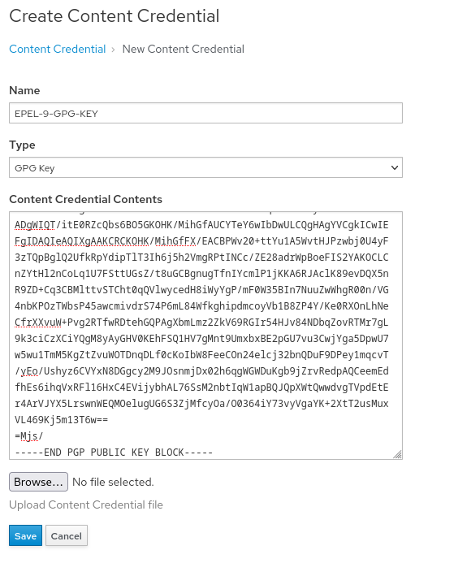

<!-- markdownlint-disable MD033 -->
Create GPG Key Entry
====================

In this step, we will create the GPG key entry for EPEL so we can enable the synchronization of EPEL's everything repo.

1. First let get the GPG key for EPEL repos. Select the `EPEL repo` tab. This will bring you to `https://dl.fedoraproject.org/pub/epel/`.

1. EPEL makes it easy to find the GPG key by naming it `RPM-GPG-KEY-EPEL-9`. Click on that file and copy the content. You will need it later.  

1. Switch back to the `Satellite Web UI` tab for the rest of the steps

1. Navigate to the Content Credentials page by hovering over `Content` and clicking on `Content Credentials`
    This is where you can tell Satellite about GPG keys and about certificates (both client and CA) for synchronizing the repositories.

     Content Credentials" src="../assets/content_content-credentials.png" />

1. Click `Create Content Credential` at the top right

1. Fill out the form with the following information  
   Name:
   ```
   EPEL-9-GPG-KEY
   ```
   Type:
   ```
   GPG Key
   ```  
   Content Credential Contents:  
    This is where you will paste the key you got during step 2.  
    ```
    -----BEGIN PGP PUBLIC KEY BLOCK-----

    mQINBGE3mOsBEACsU+XwJWDJVkItBaugXhXIIkb9oe+7aadELuVo0kBmc3HXt/Yp
    CJW9hHEiGZ6z2jwgPqyJjZhCvcAWvgzKcvqE+9i0NItV1rzfxrBe2BtUtZmVcuE6
    2b+SPfxQ2Hr8llaawRjt8BCFX/ZzM4/1Qk+EzlfTcEcpkMf6wdO7kD6ulBk/tbsW
    DHX2lNcxszTf+XP9HXHWJlA2xBfP+Dk4gl4DnO2Y1xR0OSywE/QtvEbN5cY94ieu
    n7CBy29AleMhmbnx9pw3NyxcFIAsEZHJoU4ZW9ulAJ/ogttSyAWeacW7eJGW31/Z
    39cS+I4KXJgeGRI20RmpqfH0tuT+X5Da59YpjYxkbhSK3HYBVnNPhoJFUc2j5iKy
    XLgkapu1xRnEJhw05kr4LCbud0NTvfecqSqa+59kuVc+zWmfTnGTYc0PXZ6Oa3rK
    44UOmE6eAT5zd/ToleDO0VesN+EO7CXfRsm7HWGpABF5wNK3vIEF2uRr2VJMvgqS
    9eNwhJyOzoca4xFSwCkc6dACGGkV+CqhufdFBhmcAsUotSxe3zmrBjqA0B/nxIvH
    DVgOAMnVCe+Lmv8T0mFgqZSJdIUdKjnOLu/GRFhjDKIak4jeMBMTYpVnU+HhMHLq
    uDiZkNEvEEGhBQmZuI8J55F/a6UURnxUwT3piyi3Pmr2IFD7ahBxPzOBCQARAQAB
    tCdGZWRvcmEgKGVwZWw5KSA8ZXBlbEBmZWRvcmFwcm9qZWN0Lm9yZz6JAk4EEwEI
    ADgWIQT/itE0RZcQbs6BO5GKOHK/MihGfAUCYTeY6wIbDwULCQgHAgYVCgkICwIE
    FgIDAQIeAQIXgAAKCRCKOHK/MihGfFX/EACBPWv20+ttYu1A5WvtHJPzwbj0U4yF
    3zTQpBglQ2UfkRpYdipTlT3Ih6j5h2VmgRPtINCc/ZE28adrWpBoeFIS2YAKOCLC
    nZYtHl2nCoLq1U7FSttUGsZ/t8uGCBgnugTfnIYcmlP1jKKA6RJAclK89evDQX5n
    R9ZD+Cq3CBMlttvSTCht0qQVlwycedH8iWyYgP/mF0W35BIn7NuuZwWhgR00n/VG
    4nbKPOzTWbsP45awcmivdrS74P6mL84WfkghipdmcoyVb1B8ZP4Y/Ke0RXOnLhNe
    CfrXXvuW+Pvg2RTfwRDtehGQPAgXbmLmz2ZkV69RGIr54HJv84NDbqZovRTMr7gL
    9k3ciCzXCiYQgM8yAyGHV0KEhFSQ1HV7gMnt9UmxbxBE2pGU7vu3CwjYga5DpwU7
    w5wu1TmM5KgZtZvuWOTDnqDLf0cKoIbW8FeeCOn24elcj32bnQDuF9DPey1mqcvT
    /yEo/Ushyz6CVYxN8DGgcy2M9JOsnmjDx02h6qgWGWDuKgb9jZrvRedpAQCeemEd
    fhEs6ihqVxRFl16HxC4EVijybhAL76SsM2nbtIqW1apBQJQpXWtQwwdvgTVpdEtE
    r4ArVJYX5LrswnWEQMOelugUG6S3ZjMfcyOa/O0364iY73vyVgaYK+2XtT2usMux
    VL469Kj5m13T6w==
    =Mjs/
    -----END PGP PUBLIC KEY BLOCK-----
    ```

    

1. Click `Save`
