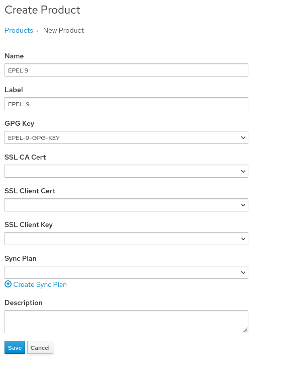

<!-- markdownlint-disable MD033 -->

Identify the Repo URL
=====================
1. Select the `EPEL Repo` tab to get back to `https://dl.fedoraproject.org/pub/epel/`

Custom repos are not required to follow a specific structure, but most of them seem to follow a similar structure.

1. At this level we can see a list of OS versions so click on `9` as we are configuring this for RHEL 9

1. Once inside the `9` directory, there is a directory for `Everything`, which is the repository we want to sync. Click on `Everything`

1. Once inside the `Everything` directory, there is a list of architectures. Our machine will be `x86_64` so click on `x86_64`

1. At this point we can see a `repodata` directory. This indicates we are at the root of a repo. At this point we would be able to copy the url. Since that is not visible in this window, copy the url below:
    ```
    https://dl.fedoraproject.org/pub/epel/9/Everything/x86_64/
    ```

Create a Product Entry
======================

Repositories are grouped together in Products within Satellite. This helps you to organize related repositories

1. Navigate to the Products menu by hovering over `Content` and clicking on `Products`

     Products" src="../assets/content_products.png" />

1. Click on `Create Product` on the top right

1. Fill out the form with the following information  
    Name:
    ```
    EPEL 9
    ```
    GPG Key:
    ```
    EPEL-9-GPG-KEY
    ```

    Label will be automatically generated as you fill out the name. You should not need to change this value  
    Everything else can be left blank

    

1. Click `Save`

Create the Everything repo entry
================================

1. You should now be in the empty Product that you just created. Click on `New Repository` on the top right

1. Fill out the form with the following information.  
    Some of the fields will not be available until you select the type.  
    Name:
    ```
    Everything
    ```

    Type:
    ```
    yum
    ```

    Restrict to Architecture:
    ```
    x86_64
    ```

    Restrict to OS version:
    ```
    Red Hat Enterprise Linux 9
    ```

    Upstream URL:  
      This is where you will enter the repo url you identified earlier
    ```
    https://dl.fedoraproject.org/pub/epel/9/Everything/x86_64/
    ```
    Ignore SRPMs: Checked

    Download Policy:
    ```
    Immediate
    ```

    SRPMs (Source RPMs) are rarely needed so it is normally safe to ignore them. If you need them in your environment, you can uncheck that field.  

    The `Download Policy` needs to be set to Immediate because there is the possiblity the upstream repo will not keep previous version of a package. You don't want to find out the version of a package you're using was removed right before you start patching prod and then have to restart your patch cycle.  
    
    The GPG Key can be left blank because we selected it at the Product level. If you do not select it at the Product level, you should select it at the Repository level  

1. Click `Save`