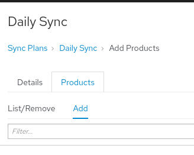
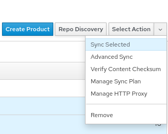
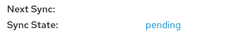

<!-- markdownlint-disable MD033 -->
Create a Sync Plan
==================

A Sync Plan is not required for synchronizing, but it will automate the process so you don't have to initiate the synchronization yourself. A daily sync is normally enough as that will keep your repositories in sync while also ensure nothing changes during the day in the middle of your work.

1. Navigate to the Sync Plans page by hovering over `Content` and clicking on `Sync Plans`
     Sync Plans" src="../assets/content_sync-plans.png" />

1. Click `Create Sync Plan` on the top right

1. Fill out the form with the following information  
    Name:
    ```
    Daily
    ```

    Interval
    ```
    daily
    ```

    Start Time
    ```
    04:00
    ```

    Since the sync will be happening every day, the `Start Date` is not important. 4am is picked as the sync time because it is early enough in the morning to complete the sync by the time the work day starts while still being late enough that any automated tasks should have completed during the night. If you have any automated tasks that run later, you should adjust the sync time.

Assign Products to Sync Plan
============================

Now that the sync plan has been created, we need to assign some products to the sync plan. This can be done from the product or from the sync plan. Since we've already created some products, it's easier to do it from the sync plan.

1. Select the `Products` tab

1. Select the `Add tab` within the `Products` tab
    

1. Check both available products and then click `Add Selected` at the top right


Manually Synchronize Repositories
=================================

Since we created a sync plan and assigned all of the products to that plan, we could initiate the sync by clicking `Select Action` and then clicking `Run Sync Plan`, however, we can also initiate the sync from the products page:

1. Navigate to the Products page by hovering over `Content` and clicking on `Products`
     Products" src="../assets/content_products.png" />

1. Select all of the available products

1. Click `Select Action` at the top right and click `Sync Selected`. Once started, this process will take a few minutes.

    

The next 2 sections are optional and show you how to see more details while syncing.

Getting More Details
====================
The page you are automatically brought to is the status page for the bulk job. It will update as each of the individual jobs complete, but it doesn't provide many details. To see more details, we need to browse to the repository and click on the status there.

1. Navigate to the Products page by hovering over `Content` and clicking on `Products`
     Products" src="../assets/content_products.png" />

1. Click on one of the products. We'll use `EPEL 9` in this example, but you can follow the same process for other repositories

1. Click on one of the repositories. `EPEL 9` only has one, so click on `Everything`

1. Near the bottom, you will find a field `Sync State` with a link that says `pending`. If you click that link, you will be taken to a different view that gives you more details about the sync progress
    

Getting an Overview
===================
Sometimes you don't want all of the details but you do want to see how everything is progress. `Sync Status` is a great place to see this information

1. Navigate to the Sync Status page by hovering over `Content` and clicking on `Sync Status`

From this page, you can:
- See the status of the products
- Expand the products (either individually or by using `Expand All`) to see the status of the repositories
- Check when the repository was last synchronized
- Check how long the last sync took
- Trigger a synchronize by checking individual repositories and clicking `Synchronize Now` at the bottom right