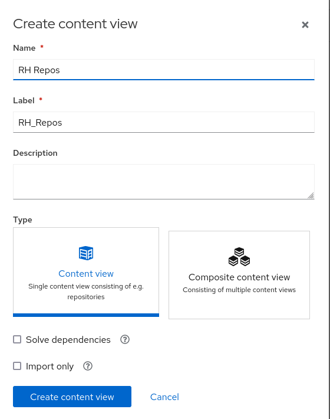

<!-- markdownlint-disable MD033 -->

Red Hat Satellite uses Content Views to create customized repositories from the synchronized repositories. You can use Content Views to define which software versions a particular environment uses. For example, a Production environment might use a Content View containing older package versions, while a Development environment might use a Content View containing newer package versions.

To learn more about Content Views and how to use them to manage content for different lifecycle environments, please see [Managing Content Views](https://access.redhat.com/documentation/en-us/red_hat_satellite/6.11/html/managing_content/managing_content_views_content-management) in Satellite documentation.

Create the RH Repos Content View
================================

1. Navigate to the Content Views page by hovering over `Content` and clicking on `Content Views`

     Content Views" src="../assets/content-content_views.png" />

1. Click `Create content view`

1. Fill out the form with the following information
    Name:
    ```
    RH Repos
    ```
    Type:
    ```
    Content View
    ```

    

1. Click `Create content view`

1. We can now add repositories to the content view. Select the Red Hat repos (the ones that start with `Red Hat`) and click `Add repositories` at the top

Create the EPEL Content View
============================

1. Use the breadcrumbs to go back to `Content Views`

    

1. Click `Create content view`

1. Fill out the form with the following information
    Name:
    ```
    EPEL
    ```
    Type:
    ```
    Content View
    ```
    Solve dependencies: Checked

    

1. Click `Create content view`

1. We can now add repositories to the content view. Select the `Everything` repo and click `Add repositories at the top

EPEL, like some other custom repos, has the possiblity of having conflicting packages. These packages can sometimes cause issues when trying to patch machines. A simple way to handle this is to filter the repo down to only the packages you need. Unfortunately, you then have to figure out what packages those packages depend on and then what packages those depend on and so on and so on. However, Satellite has a feature for this. When we created this content view, we selected `Solve dependencies`. This will override the filter and add in the packages that the packages in our filter require.

1. While still within the `EPEL` content view, select the `Filters` tab

    

1. Click `Create filter`

1. Fill out the form with the following information
    Name:
    ```
    Allowed Packages
    ```
    Content type:
    ```
    RPM
    ```
    Include filter: Selected

    

1. Click `Create filter`

1. Now we can add the packages we need to the filter. Click `Add RPM rule` to add a rule

1. Enter `fail2ban` as the name and click `Add rule`

    

Create the Everything Composite Content View
============================================

Composite Content Views are good for combining the content of multiple Content Views. In this case, one content view with a filtered version of EPEL and one content view with all of the RH repos.

1. Use the breadcrumbs to go back to `Content Views`

    

1. Click `Create content view`

1. Fill out the form with the following information
    Name:
    ```
    Everything
    ```
    Type:
    ```
    Composite Content View
    ```
    

1. Select both content views and click `Add content views` at the top
