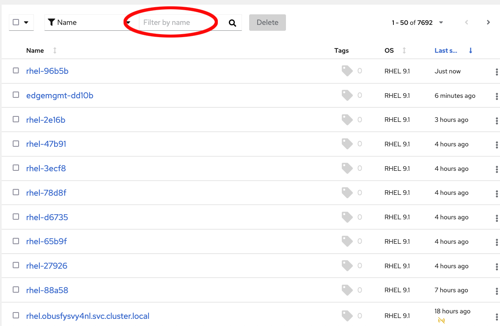
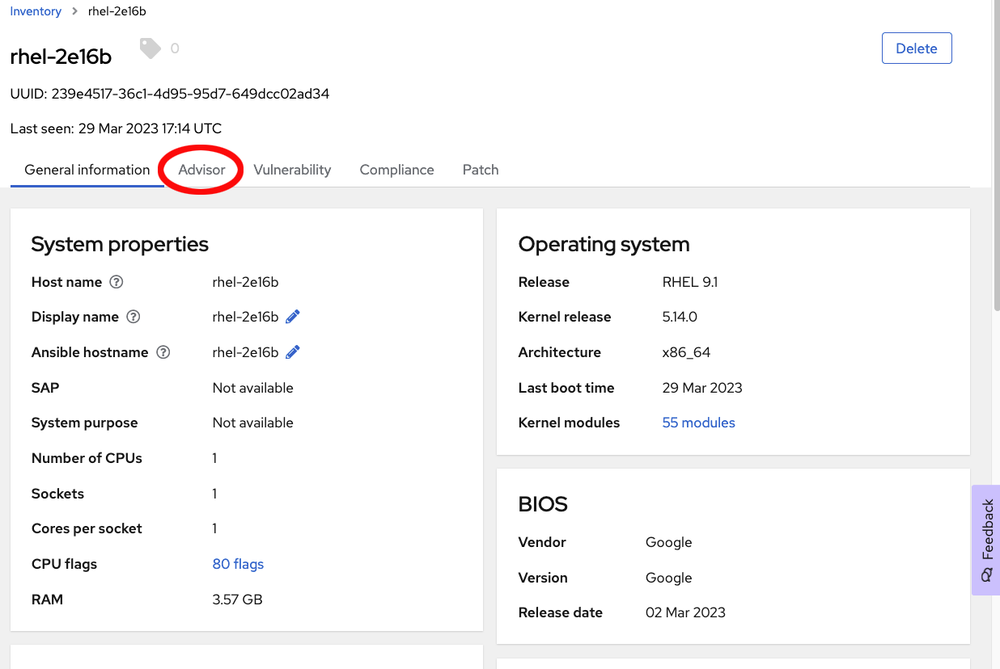
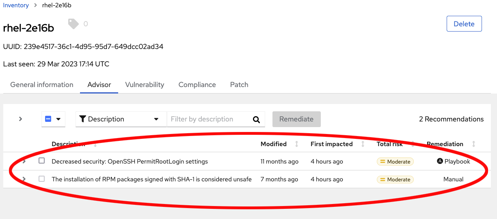

>_NOTE:_ To make the inline images larger, expand this window.


In the pane on the left, where your terminal was, you should now have a button to launch the Hybrid Cloud Console in an external window.  Press the button. You will then need to login with the following credentials.

Login:

```bash
rhel-df93
```

Password:

```bash
Redhat1!
```


Once you are logged in, using the credentials provided above, navigate to
_Red Hat Enterprise Linux_ in the left-side navigation menu, and select _Red Hat Insights_ below it.


Now, if you click on the Inventory menu item on the left side, you'll see a list of systems registered to insights for this lab account.  Search for your lab host using the `Filter by name` search box at the top of the inventory list.



If you click on your system in the list, you will be brought to that hosts detail page.

You can see the amount of information that insights is able to report to you about your system under the general tab.

Head over to the Advisor tab, and we'll see if that Advisor service has any recommendations for our system.



You can see that our system has a few recommendations.  The Remediation column tells us whether Insights can remediate these via a playbook, or if they need to be remediated manually.  In this example the first item in the list could be remediated via a playbook.



Next we'll look at the Vulnerability tab.

