The Ansible Automation Platform is preconfigured with the following Resources:

Hosts:

- rhel
- rhel2
- rhel3

Projects:

- Demo Project

Credentials:

- acme_ssh_key

Inventories

- Production Hosts

For more information on Ansible Automation Platform configuration, please consult [the official product documentation](https://access.redhat.com/documentation/en-us/red_hat_ansible_automation_platform/2.2).

In order to expedite the operation of this lab, we have pre-installed RHEL system roles into the `Demo Project`.

We have also configured `Demo Project` to use a preconfigured playbook from this public github repository:
<https://github.com/myee111/aap_demo_ansiblefest>

This leaves us with the task of populating the variables required to configure our hosts with the RHEL system roles specified in the aforementioned playbook in the `Demo Project`.

The RHEL system roles we'll be applying to our hosts rhel, rhel2, rhel3 are:

- redhat.rhel_system_roles.firewall - Firewall
- redhat.rhel_system_roles.timesync - Timesync
- redhat.rhel_system_roles.cockpit - Cockpit aka Web Console
- redhat.rhel_system_roles.tlog - Tlog aka terminal session recording
- redhat.rhel_system_roles.sshd - Secure Shell Daemon
- redhat.rhel_system_roles.crypto_policies - System-wide Cyptographic Policies
- redhat.rhel_system_roles.metrics - Grafana and Performance Co-pilot

Let's edit the `Production Hosts`. We'll add variables that will apply to all our hosts first.

1) Navigate to the `Inventories` menu.
2) Click on `Production Hosts`.

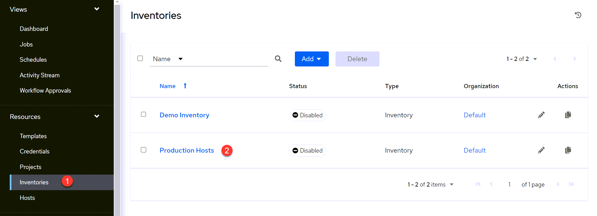

Click on `Edit` while focused on the Details tab.

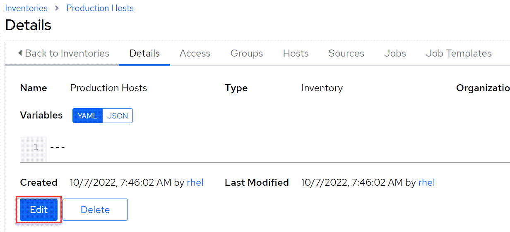

Expland the `Variables` text area.

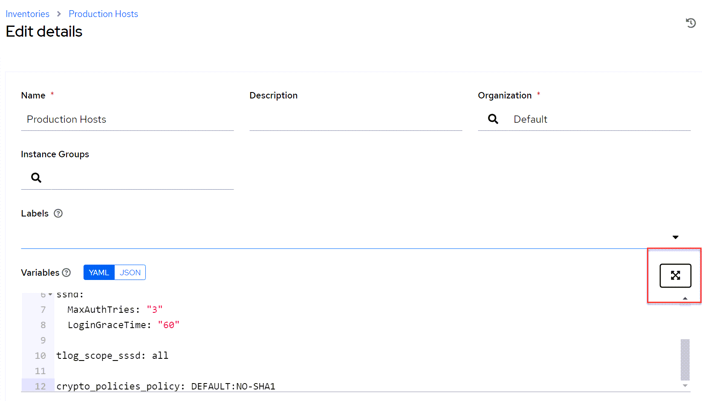

Copy the following yaml code block and paste it into the `Variables` text area.

  ```yaml
  ---
  timesync_ntp_servers:
    - hostname: 2.rhel.pool.ntp.org
      iburst: yes

  sshd:
    MaxAuthTries: "3"
    LoginGraceTime: "60"

  tlog_scope_sssd: all

  crypto_policies_policy: DEFAULT:NO-SHA1
  ```

Click `Done`.

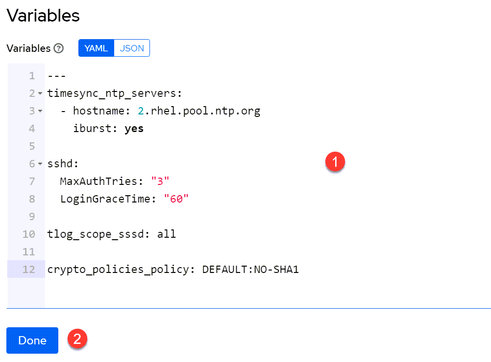

Save the variables.

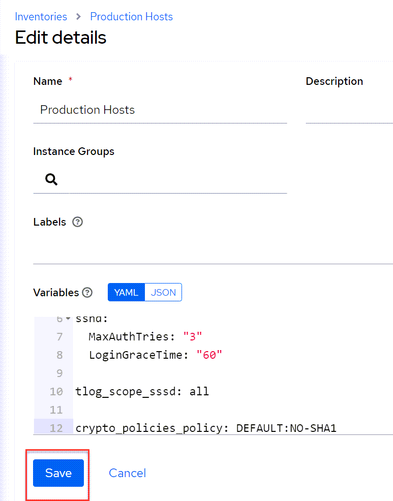

We have just configured all of our hosts to use the following RHEL system roles configurations

- Timesync: custom NTP settings
- SSH daemon: SSH daemon: permit 3 login attempts per connection, and only allow 60 seconds for the user to authenticate
- Terminal logger: record all users
- Cryptographic policies: use DEFAULT policy with NO-SHA1 module

Next, we'll configure policies specific to the Metrics system role. We'll need to designate `rhel` as the Grafana server to collect data from `rhel2` and `rhel3`.

Click on `Groups`.


Click on `Add`.

We'll name this group `Metrics Server`.

Copy and paste the following variables into the `Metrics Server` group. These variables configure the Grafana server and also enable the firewall to permit connections to the Grafana dashboard and connect to the Web Console.

```yaml
---
metrics_graph_service: yes
metrics_query_service: yes
metrics_retention_days: 7
metrics_monitored_hosts: "{{ groups['all'] }}"

firewall:
  - service: grafana
    state: enabled
  - service: cockpit
    state: enabled
```

Click `Save` to save the group.

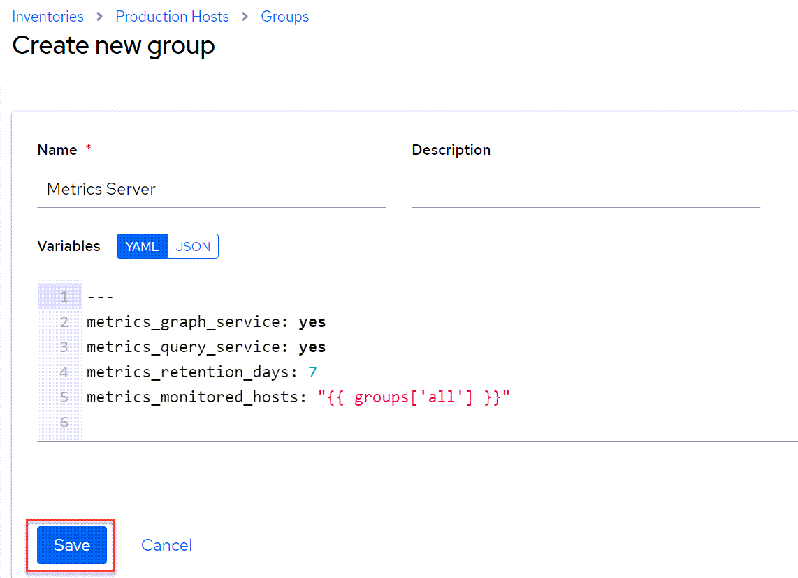

Click `Back to Groups`.

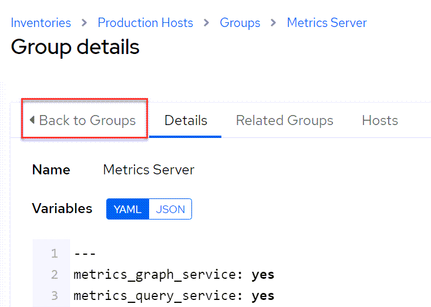

Add another group and call it `Metrics Hosts`

Copy and paste the following variables into the `Metrics Hosts` group. Save the group when done. These variables configure 7 day retention of metrics and permit network connections to the PCP service and Web Console service through the firewall.

```yaml
---
metrics_retention_days: 7

firewall:
  - service: pmcd
    state: enabled
  - service: cockpit
    state: enabled
```

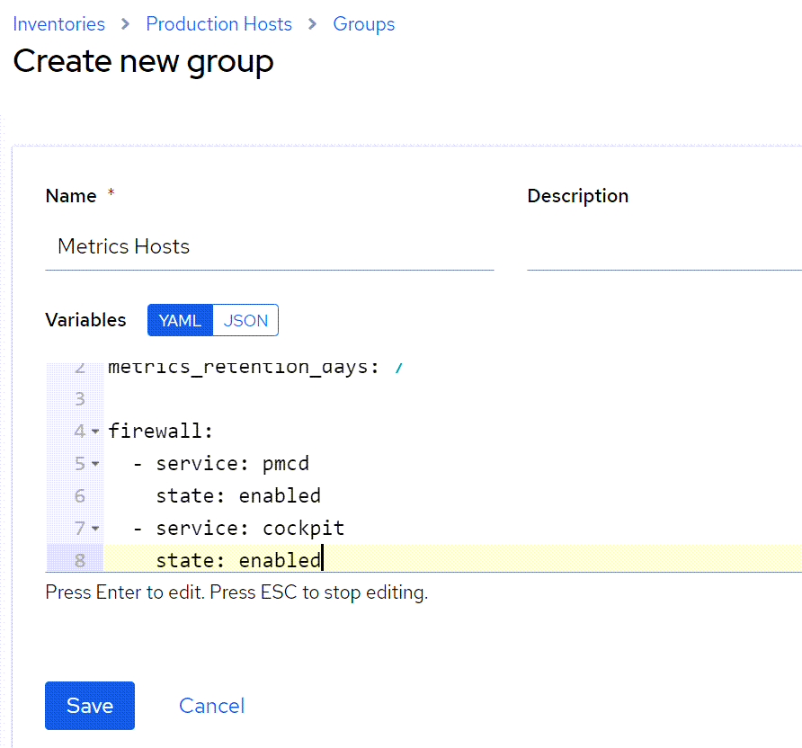

Click on `Metrics Server`.

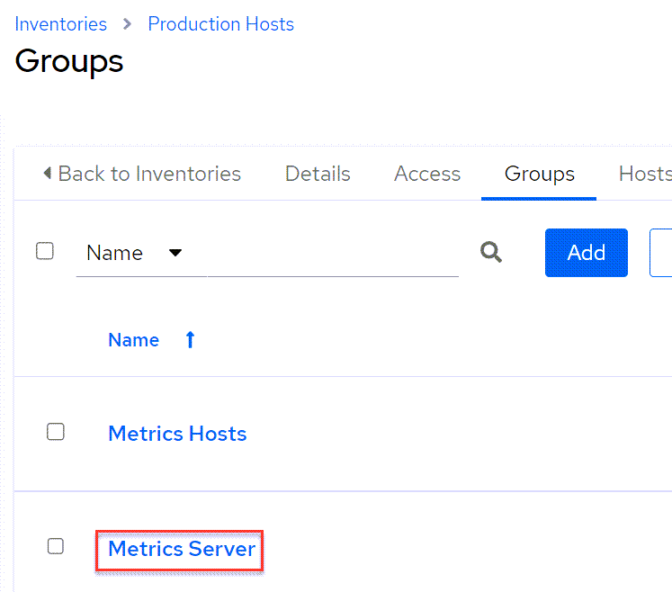

Click on `Hosts`.

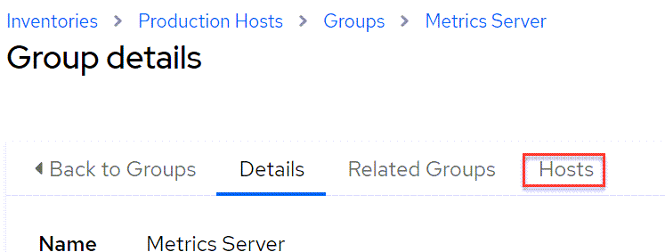

Next, add `rhel` to the group:

Click on `Add`.
Select `Add existing host`.

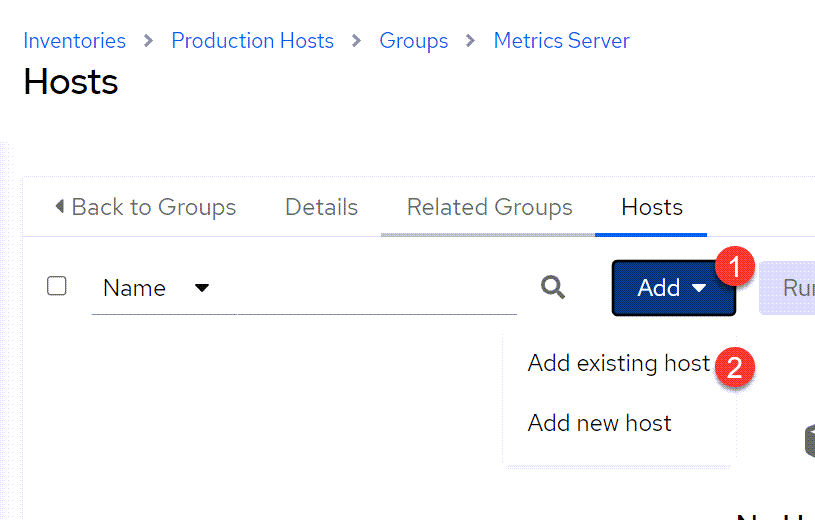

Click on `rhel`.
Click `Save`.

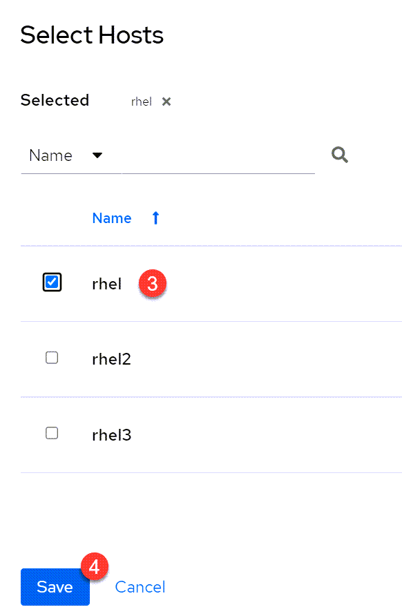

Go back to groups, click on Metrics Hosts and add `rhel2` and `rhel3` to `Metrics Hosts`.

1) Click on `Metrics Hosts`.
2) Click on `Hosts`.
3) Click on `Add` and select `Add existing host`.
4) Select `rhel2` and `rhel3`.
5) Click on `Save`.

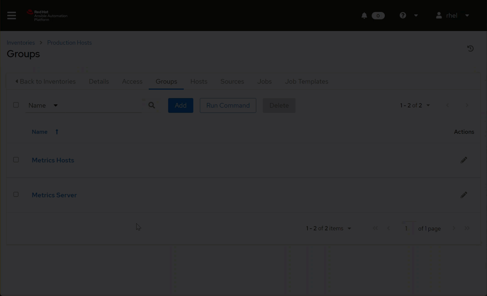

The inventory is now configured properly for our system roles.
