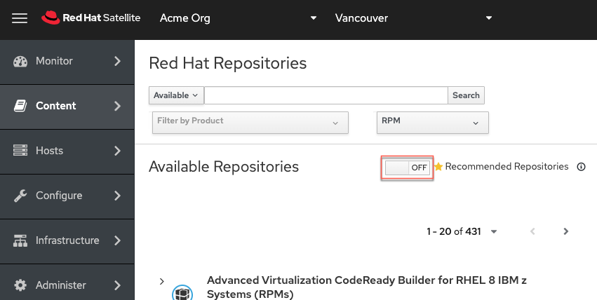

<!-- markdownlint-disable MD033 -->
## <ins>Synchronize repositories</ins>

Navigate to the Red Hat Repositories menu by clicking on `Red Hat Repositories` in the menu context below.

The Red Hat Repositories menu will provide a list of available repositories. You can choose to synchronize whatever you want. In this lab we'll synchronize the `BaseOS` and `AppStream` repos for RHEL 9.

Red Hat Enterprise Linux 9 is distributed through two main repositories:

* BaseOS
* AppStream

Both repositories are required for a basic RHEL installation, and are available with all RHEL subscriptions.

Content in the BaseOS repository is intended to provide the core set of the underlying OS functionality that provides the foundation for all installations. This content is available in the RPM format and is subject to support terms similar to those in previous releases of RHEL. For more information, see the Scope of Coverage Details document.

Content in the AppStream repository includes additional user-space applications, runtime languages, and databases in support of the varied workloads and use cases.

Click on the `Recommended Repositories` button to create a more succinct view of available repos (the image below displays the button in the off position; turn it on).

Here's what it looks like to add the BaseOS and AppStream repos.

And here's an animation.

Next, we'll navigate to the `Products` menu.

Select the required product (in this case `Red Hat Enterprise Linux for x86_64`) and click `Sync Selected`.

To view the status of the sync operation, click on `Sync Status`.

Expand the menu widgets to see a detailed report on the sync status.

>_NOTE:_ The BaseOS and AppStream repos take approximately 5 minutes to synchronize.

