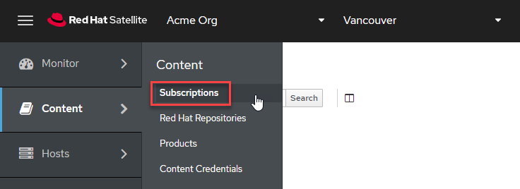
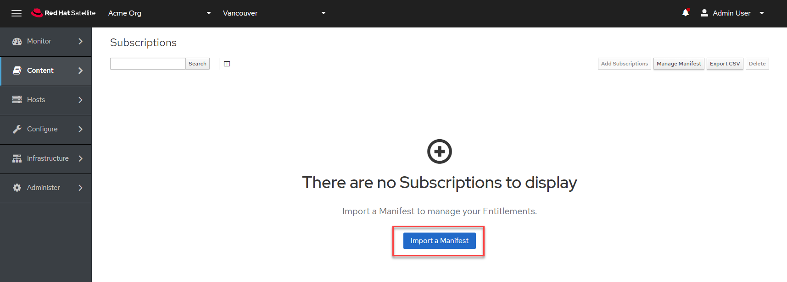
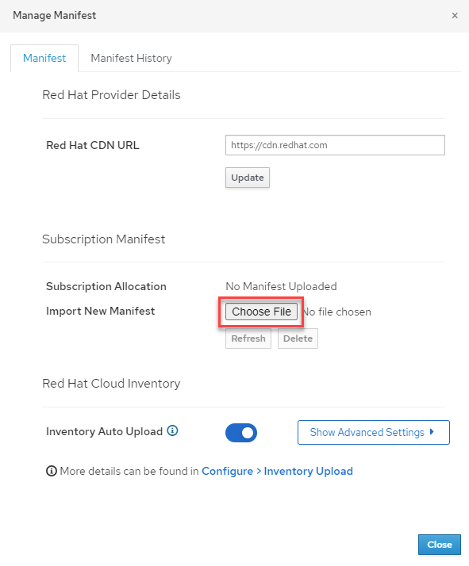
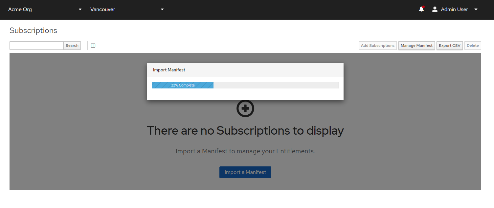

<!-- markdownlint-disable MD033 -->

## <ins>Log into the Satellite Web UI</ins>

If you haven't done so, log into the Satellite Web UI.

Username:

```bash
satadmin
```

Password:

```bash
bc31c9a6-9ff0-11ec-9587-00155d1b0702
```

## <ins>Upload a manifest</ins>

A subscription manifest contains a list of the subscriptions, products, and content repositories entitled to an organization. The manifest must be obtained from the customer portal at access.redhat.com. For more information, please read the article.

<https://access.redhat.com/solutions/118573>

For this lab, we have created a manifest for you.

Click on `Subscriptions` within the following sub-menu show below.



Next, click on the button labelled `Import a manifest`.



Click on the button labelled `Choose File`.



Select your manifest file to upload it to the Satellite server.

You'll see a progress bar showing the progress import operation.


