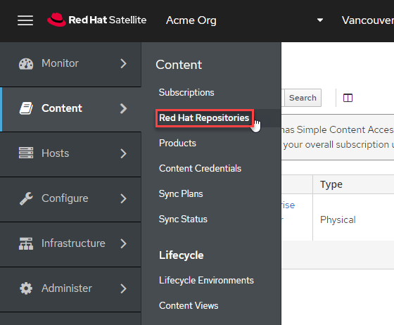
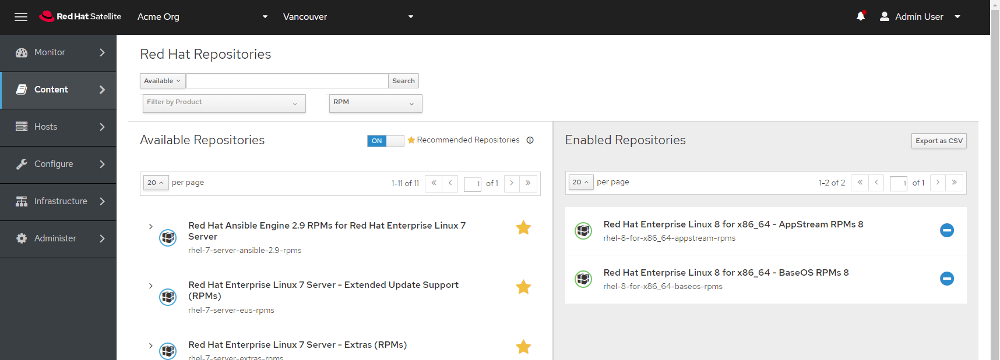
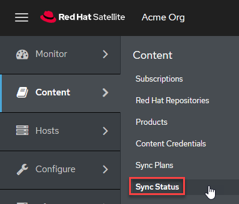
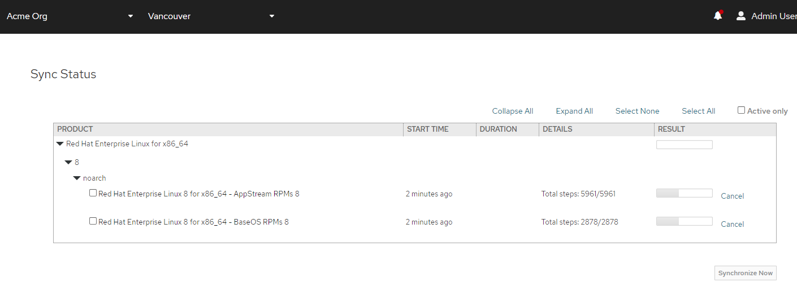

<!-- markdownlint-disable MD033 -->
## <ins>Synchronize repositories</ins>

Navigate to the Red Hat Repositories menu by clicking on `Red Hat Repositories` in the menu context below.

The Red Hat Repositories menu will provide a list of available repositories. You can choose to synchronize whatever you want. In this lab we'll synchronize the `BaseOS` and `AppStream` repos for RHEL 9.

Next, we'll navigate to the `Products` menu.

Select the required product (in this case `Red Hat Enterprise Linux for x86_64`) and click `Sync Selected`.

To view the status of the sync operation, click on `Sync Status`.

Expand the menu widgets to see a detailed report on the sync status.

>_NOTE:_ The BaseOS and AppStream repos take approximately 15 minutes to synchronize.
