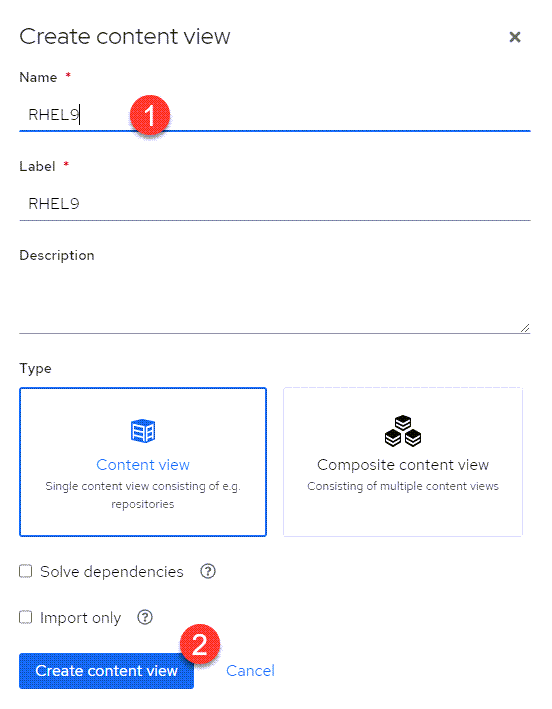
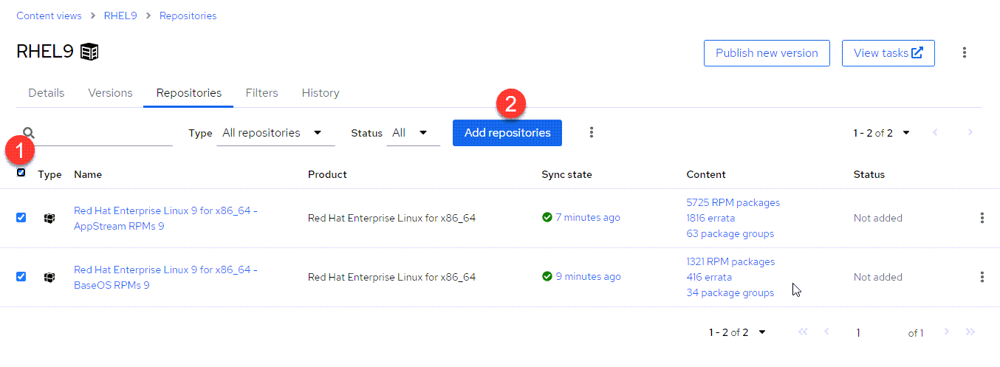
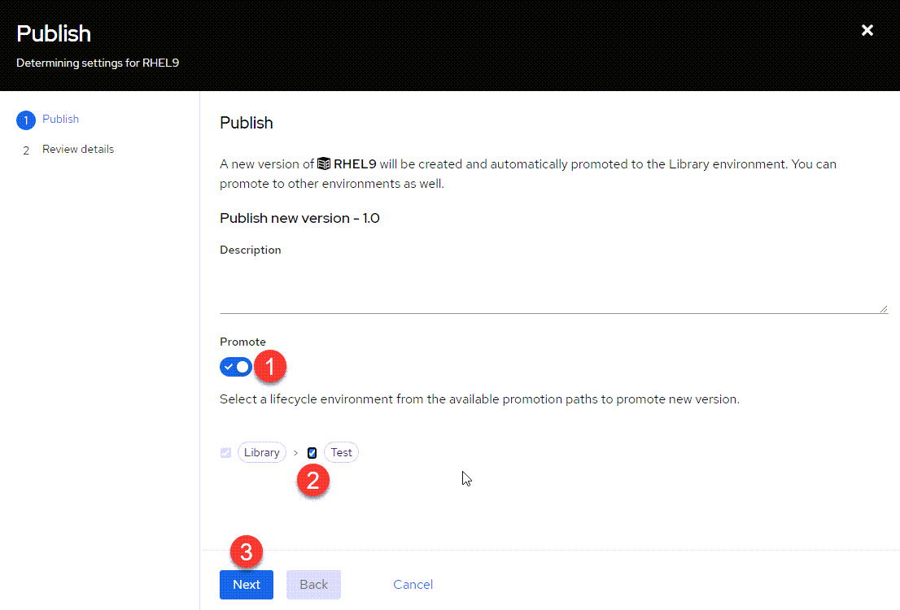

<!-- markdownlint-disable MD033 -->

Click on `Content Views`.

Click on `Create New View`.

We'll name this content view `RHEL9`. Click `Create content view` to save it.

> **NOTE:** Please ensure that you type `RHEL9` in capital letters. We'll need this value in step 6 of this lab.

Add the `BaseOS` and `AppStream` repos. Click `Add Repositories`.

Click `Publish New Version`.

Next we'll complete the following steps to publish and promote the content view.

1) Click the sliding `Promote` button.
2) Select the lifecycle environment you wish to promote the content view to. In this case it is `Test`.
3) Click `Next` to review the task.

Review the details and then click `Finish`.
