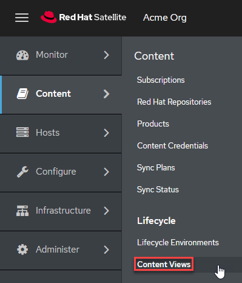
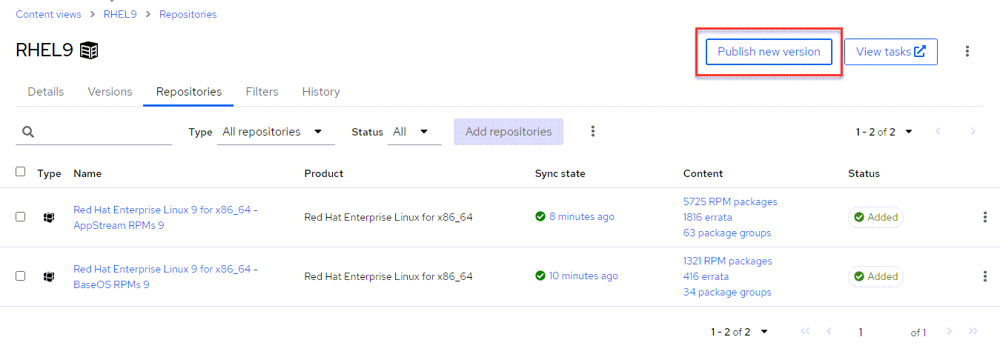
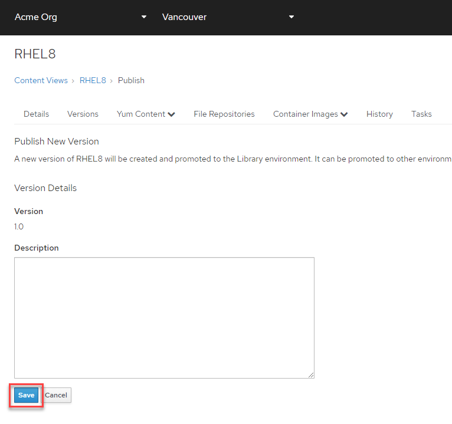
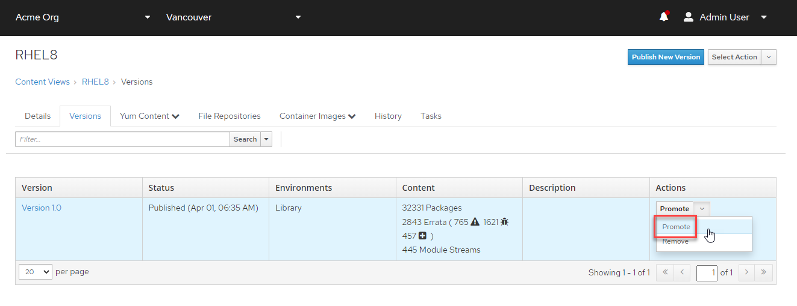
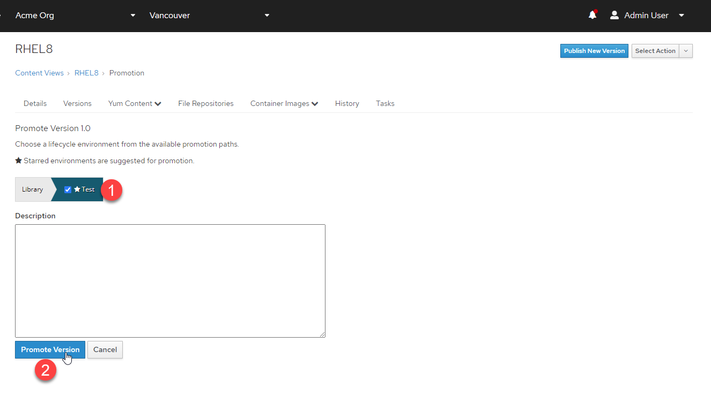

<!-- markdownlint-disable MD033 -->

Click on `Content Views`.

Click on `Create New View`.

We'll name this content view `RHEL8`. Click `Save` to save it.

Add the `BaseOS` and `AppStream` repos. Click `Add Repositories`.

Click `Publish New Version`.

Click `Save`.

The content view will proceed to be published.

Promote this content view to the `Test` lifecycle environment by clicking `Promote`.

Select `Test` and then click `Promote Version`.

