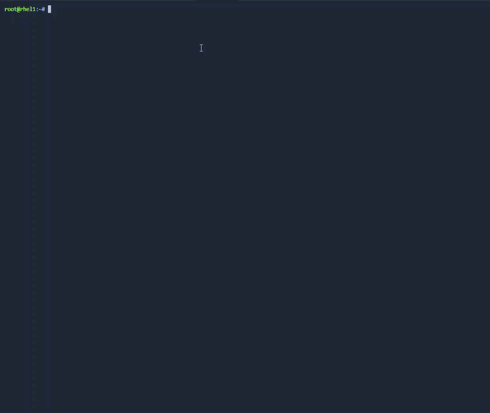

<!-- markdownlint-disable MD033 -->

Now we'll register the hosts `rhel1` and `rhel2` to our Satellite server. We'll use the command line interface to generate a registration command in this lab. It is also possible to generate a registration command from the Satellite WebUI but due to the limitations of DNS in this lab environment, we'll use the cli utility `hammer` to simplify the process.

Click on the `Satellite Server` tab.


Copy and paste the following command into the terminal.

```bash
hammer host-registration generate-command --activation-key RHEL9 --force 1 --insecure 1 --organization "Acme Org" --location "Vancouver"
```

Copy the output by highlighting the selected text. Once the primary click mouse, button is released, the text will be automatically saved to the clipboard.


Now click on the `rhel1` tab.


Right click and select paste to paste the command into the terminal. Finally type enter to execute the registration command.



When your host is registered, the output will resemble something similar below.


Register `rhel2` with the Satellite server by pasting the registration command into the CLI of `rhel2`.

In the Satellite Web UI, navigate to `All Hosts` to view the newly registered host.


You can check that your host repos are configured for the Satellite server `satellite.lab` by entering the following:

```bash
cat /etc/yum.repos.d/redhat.repo
```


