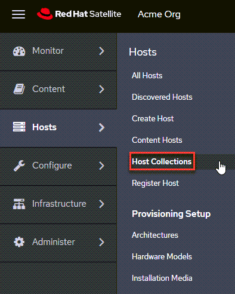
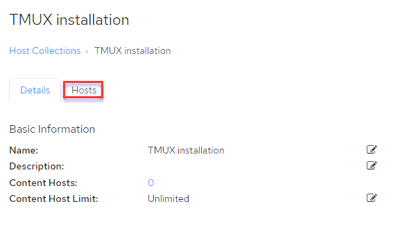
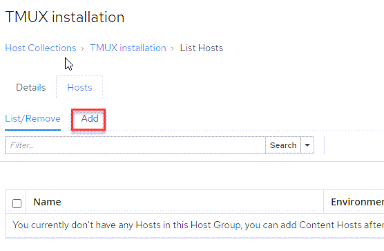
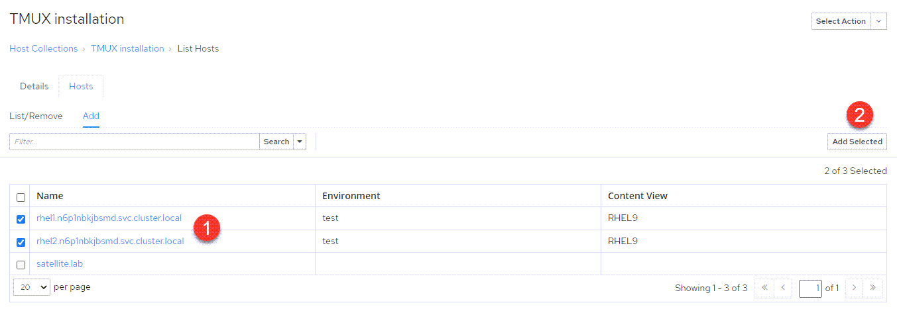
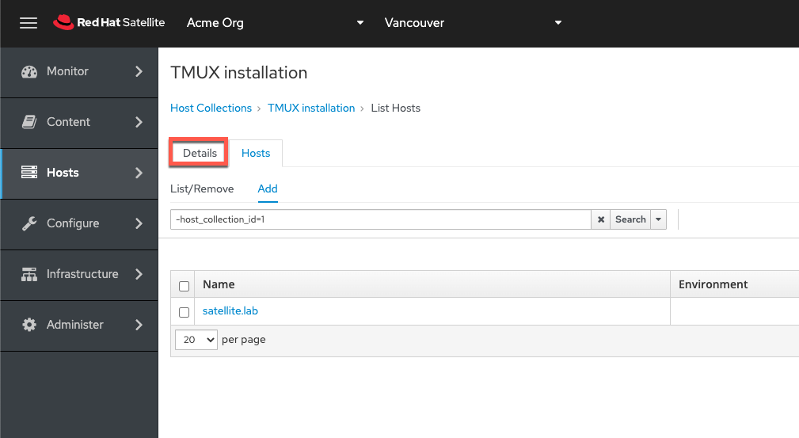
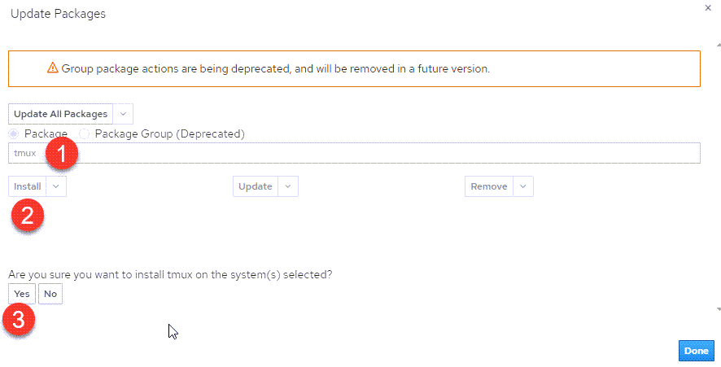
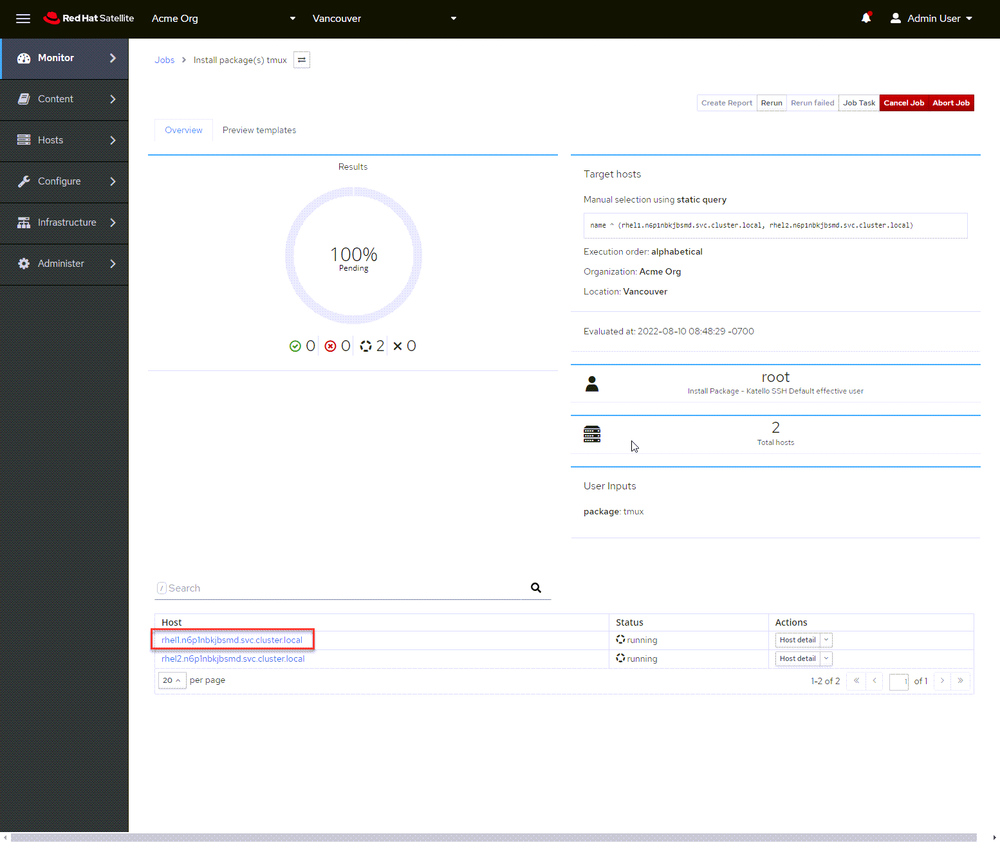
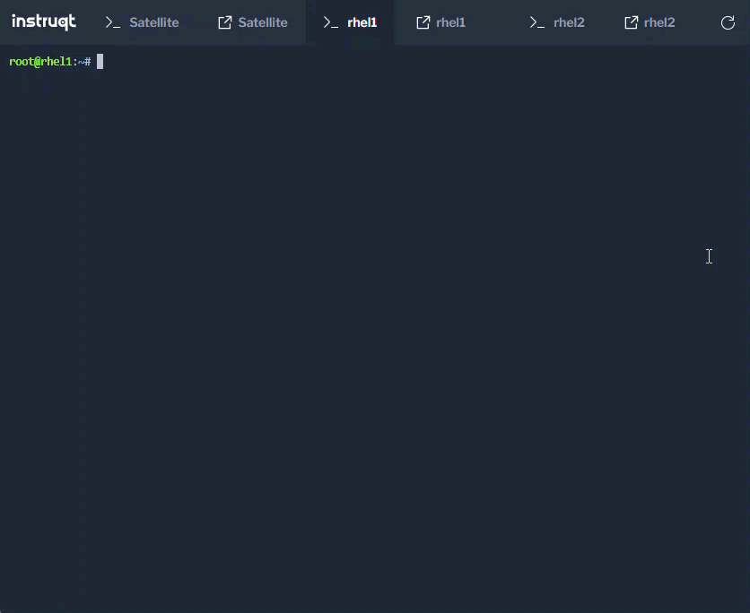

<!-- markdownlint-disable MD033 -->

> preamble on why we're using host collections

First we'll create a Host Collection. Click on `Host Collections` in the menu.



Click `Create Host Collection`.


Next, do the following:

1) Name the `Host Collection`. In this case we'll name it `TMUX installation`.
2) Click `Save`.


Click on `Hosts`.



Click on `Add`.



Select the hosts we want to install `tmux` on, then click `Add Selected`.



You'll be taken back to the `Host Collections` menu. Click on the host collection we just created.



Click on `Package Installation, Removal, and Update`.


Do the following:

1) Type in the package name. In this case we'll install `tmux`.
2) Click `install`.
3) Click `yes`.



You'll be taken to the job status page.



You can check on the real-time installation progress by clicking on a host.


When the installation has completed, click on the terminal of `rhel1` or `rhel2` and run `tmux`.

```bash
tmux
```


