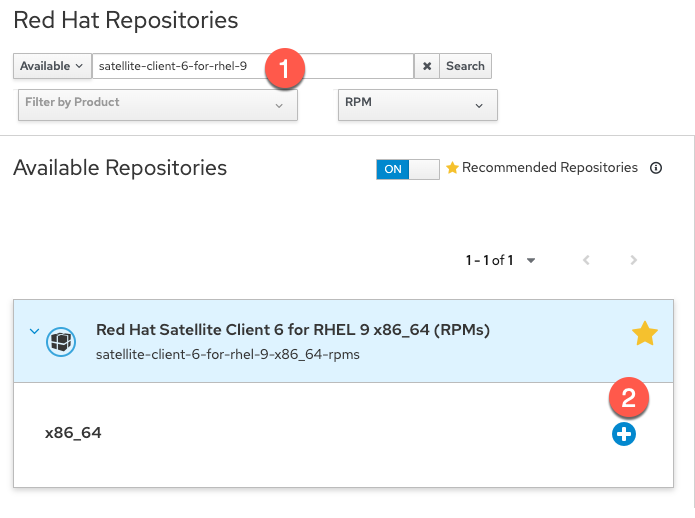
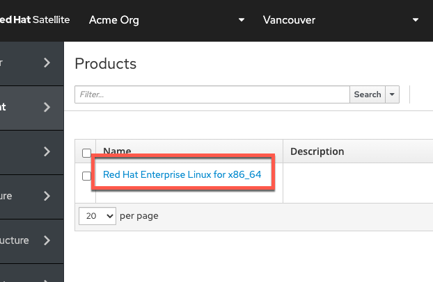
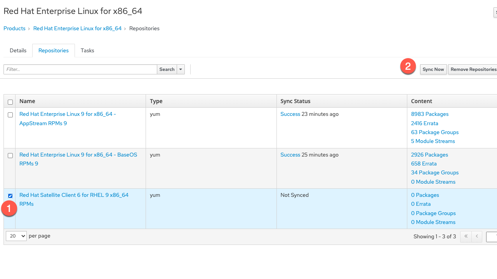
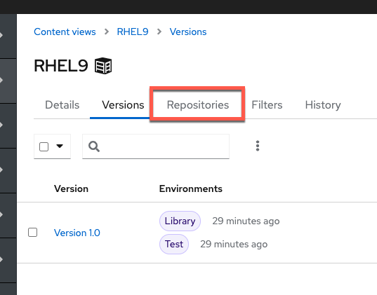
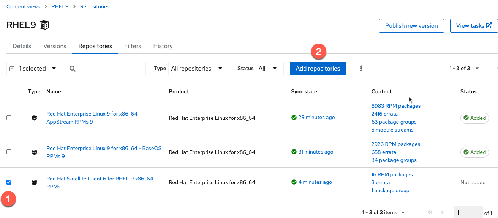
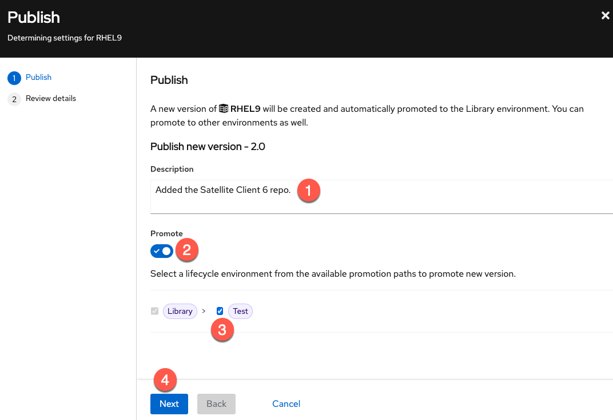
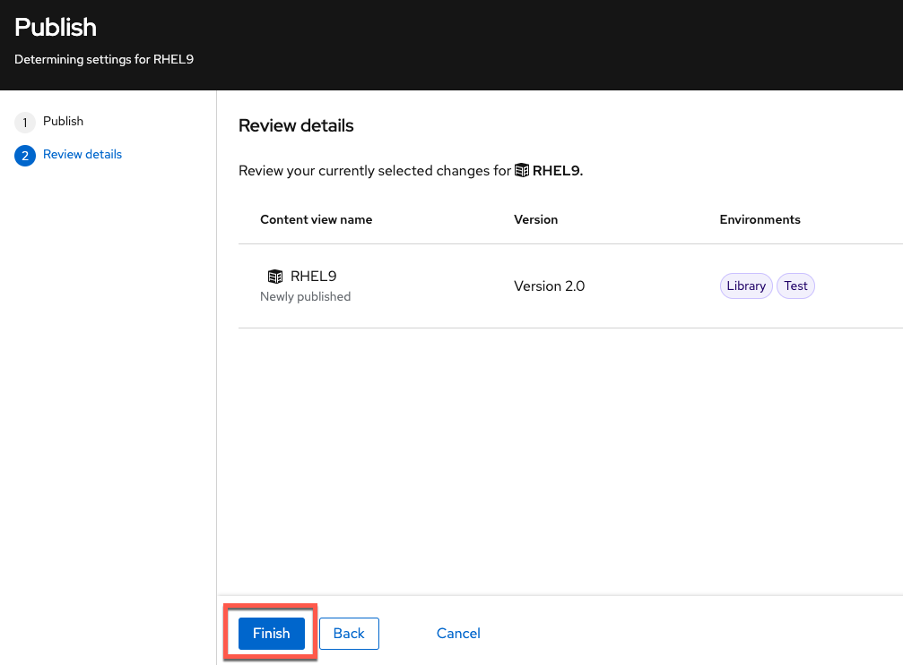
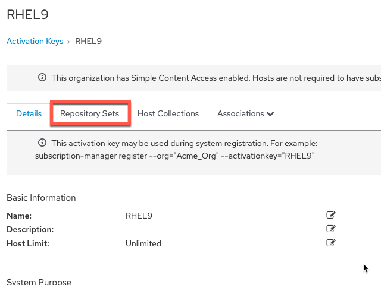
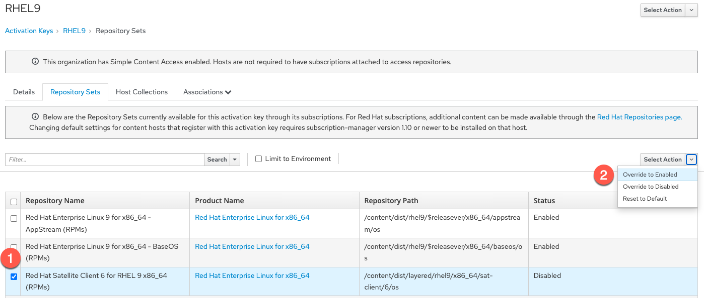

<!-- markdownlint-disable MD033 MD029-->

Often when software is updated, services on a host must be restarted before the new software can run. The tracer utility can detect when a service needs to be restarted, and notify you through Red Hat Satellite.

To demonstrate this capability, we'll install the `katello-host-tools-tracer` package on our hosts through remote execution. We'll perform the following tasks:

1) Synchronize the `Satellite client 6` repository to our Satellite server.
2) Make the repository available to our hosts by adding it to our `RHEL9` content view.
3) Install `katello-host-tools-tracer` on our hosts.

Go to `Content` and click on `Red Hat Repositories`.


Next add the `satellite-client-6-for-rhel-9` repository.

1) Paste the following into the search bar.

```bash
satellite-client-6-for-rhel-9
```

2) Click the `+` symbol.



Next, we'll navigate to the `Products` menu.


Click on `Red Hat Enterprise Linux for x86_64`.



Do the following to synchronize the repository with Satellite.

1) Select `Red Hat Satellite Client 6 for RHEL 9 x86_64 RPMs`.
2) CLick `Sync Now`.



Navigate to `Content Views`.


Click on the `RHEL9` content view.


Click on the `Repositories` tab.



Add the repo.

1) Click on `Red Hat Satellite Client 6 for RHEL 9 x86_64 RPMs`.
2) Click `Add repositories`.



Click `Publish new version`.


We'll now publish a new version of the content view.

1) Add a description to the new version of the content view. In this example we added `Added the Satellite Client 6 repo.`.
2) Click `Promote`.
3) Click on the `Test` lifecycle environment.
4) Click `Next`.



Click `Finish`.



Now we'll enable access to the `Red Hat Satellite Client 6 for RHEL 9 x86_64 RPMs` repo.

Navigate to `Activation Keys`.


Click on the `RHEL9` activation key.


Click on `Repository Sets`.



Override the `Red Hat Satellite Client 6 for RHEL 9 x86_64 RPMs` repository to `Enabled`.

1) Select the `Red Hat Satellite Client 6 for RHEL 9 x86_64 RPMs` repository.
2) Click `Override to Enabled`.



Next we'll update the repository configuration on each host.

```bash
dnf config-manager --set-enabled satellite-client-6-for-rhel-9-x86_64-rpms
```

Navigate to `All hosts`.


1) Select the two new hosts.
2) Click `Schedule Remote Job`.


We can now install `katello-host-tools-tracer` on our hosts.

Create a host collection containing our hosts.
