<!-- markdownlint-disable MD033 MD026-->

Navigate to the Image Builder application:

Click on `Services`.

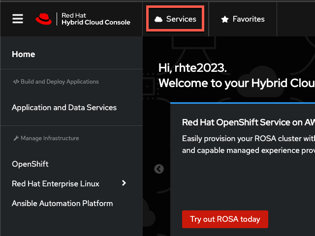

1) Type `Image` in the search bar.
2) In the `Deploy` card, click `Images`.

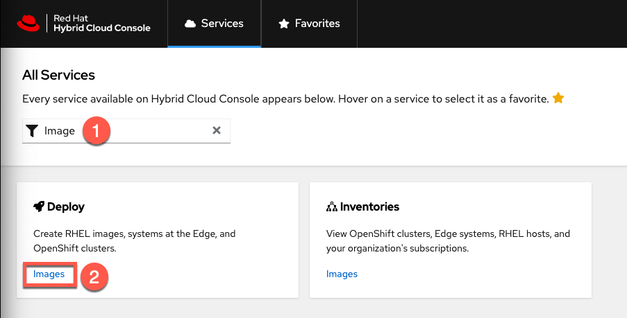

Click on the `Create image` button.

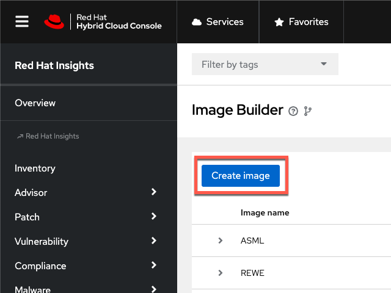

We'll configure the `Image output`.

1) Select `Red Hat Enterprise Linux (RHEL) 9`.
2) Select `Amazon Web Services`.
3) Click `Next`.

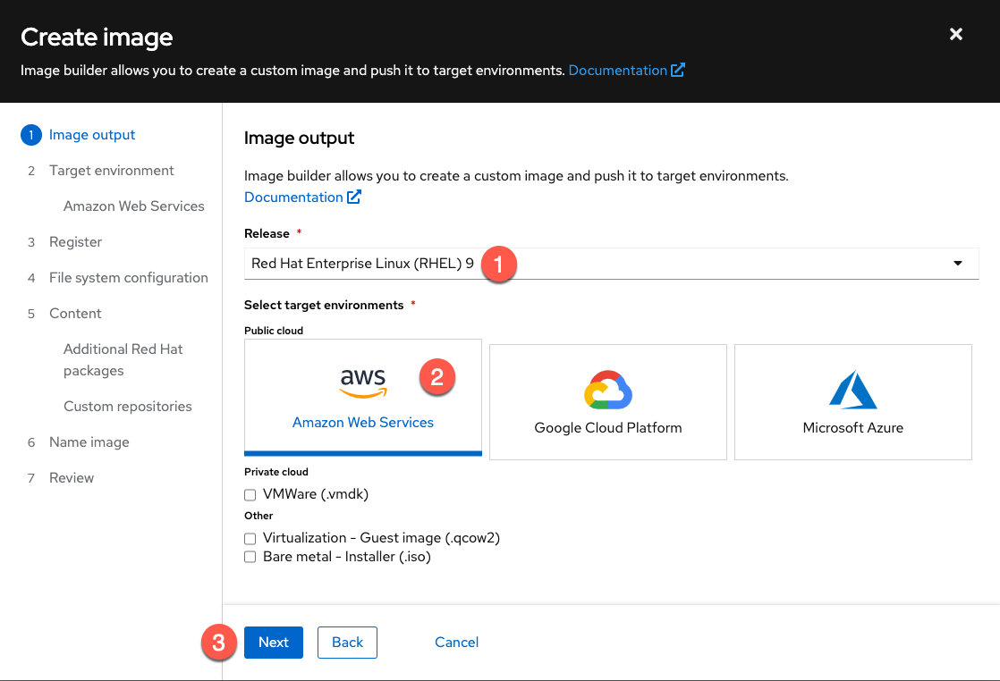

Configure the `Target environment`.

1) Select `Use an account configured from Sources`. This selects an AWS account that was preconfigured for this lab.
2) Select the source labelled `RHTE`.
3) Observe that the `Default Region` and `Associated Account ID` are prefilled.
4) Click on `Next`.

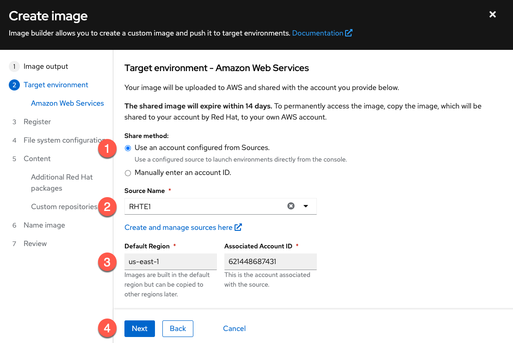

Configure system registration in `Register`.

1) Select `Automatically register and enable advanced capabilities`.
2) Select the activation key `rhte`.
3) Click `Next`.

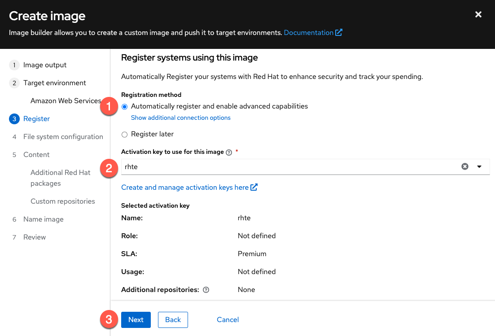

Accept the default `Automatic partitioning` in `File system configuration` and click `Next`.

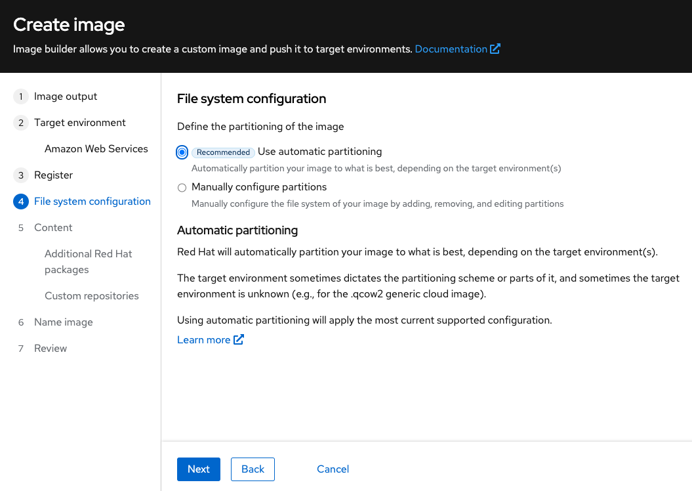

Next we'll add software to the image.

1) In `Available packages` search for, and add the following software:
      - `podman`
      - `rhc`
      - `rhc-worker-playbook`
      - `ansible-core`
2) You may also add any other software you wish.
3) Click `Next`.

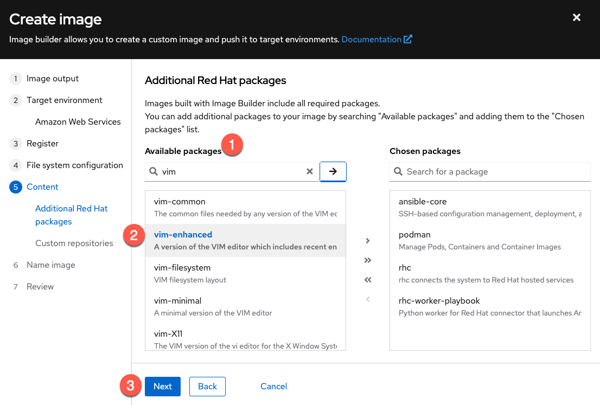

We'll add some packages from custom repositories.

1) Check off the following `Custom repositories`.

   - `CustomRepo`
   - `EPEL 8 Everything x86_64`

2) Then click `Next`.

Add packages from the custom repositories.

1) Add the following packages.
   - `ubi-init`
   - `openvpn`

2) Click `Next`.

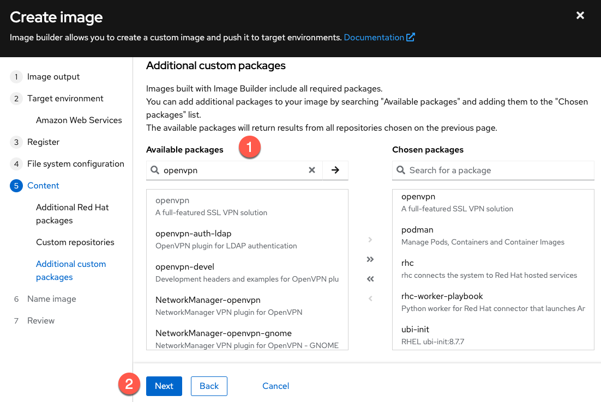

Give your image a name and click `Next`.

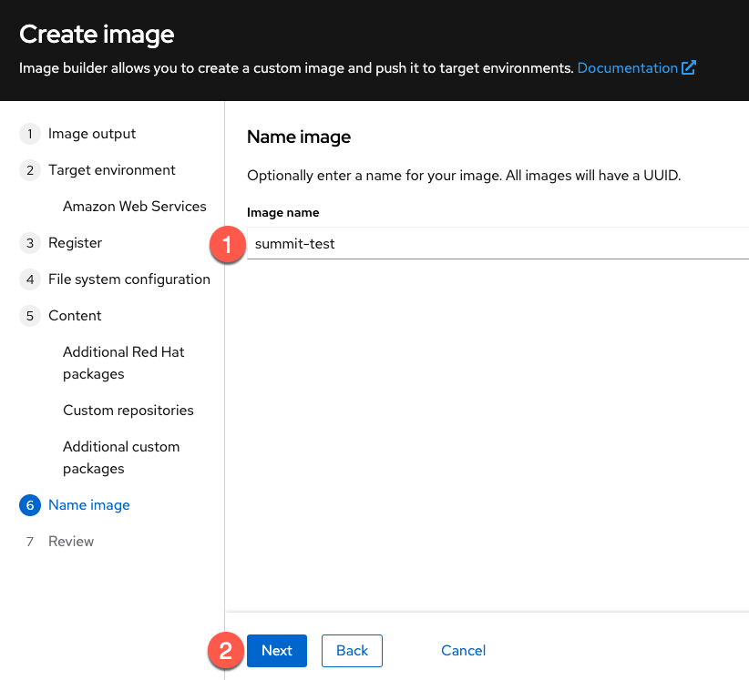

Review the configuration and then click `Create image`.

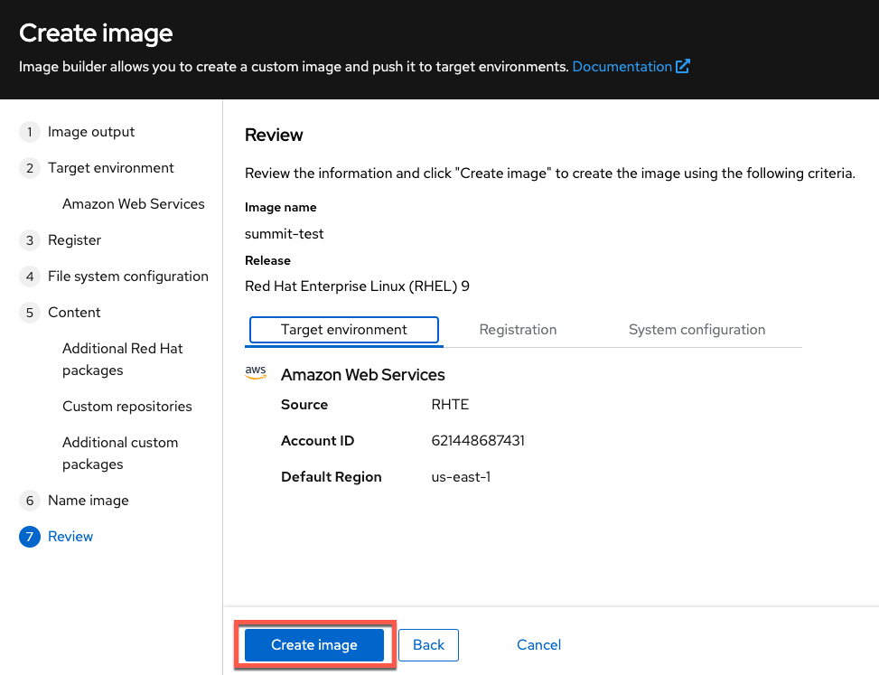

The image build process will take about 15-20 minutes.

Proceed to the next step of this lab where you may continue with pre-built images.
