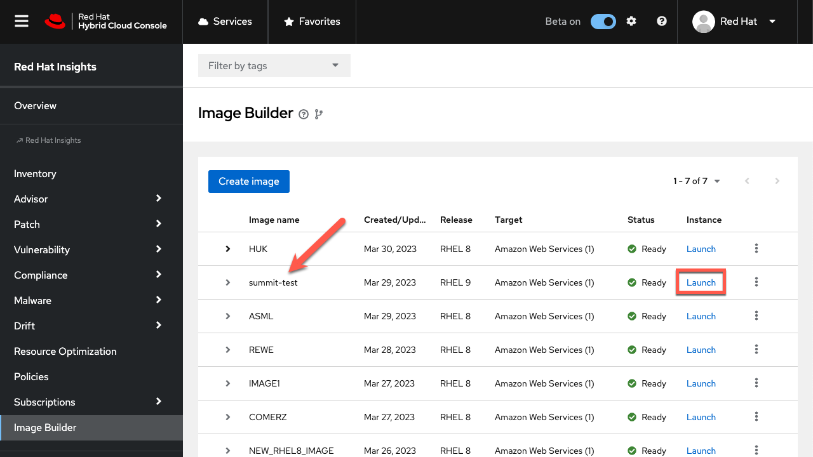
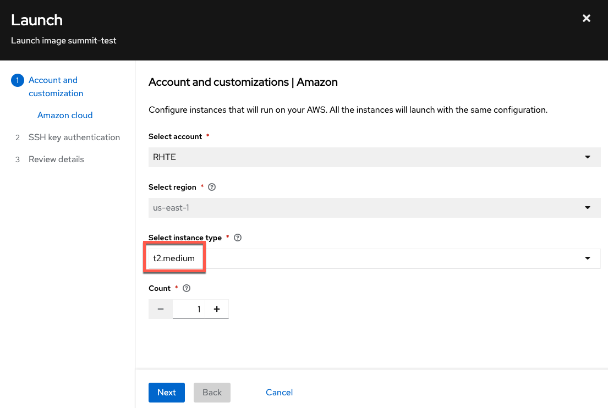
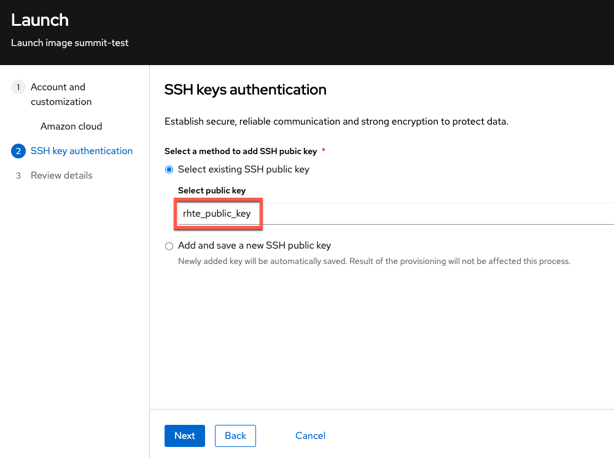
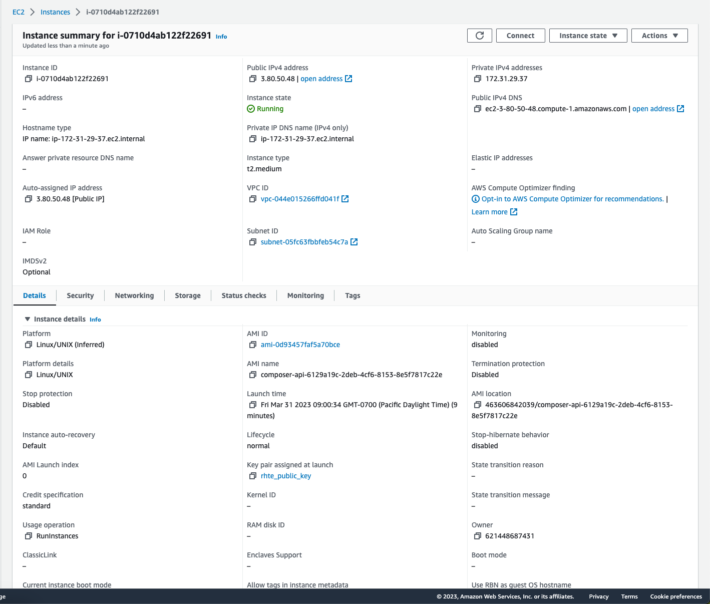
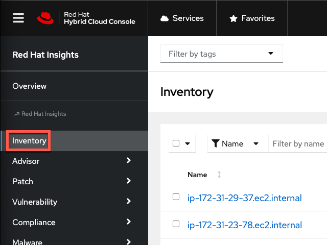
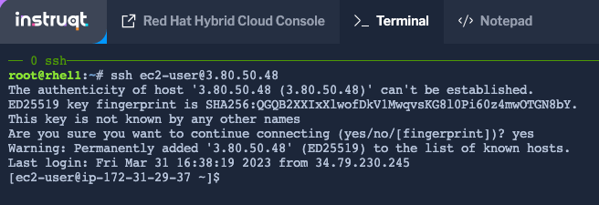

<!-- markdownlint-disable MD033 MD026-->

In the `Image Builder` menu, find the `summit-test` image. Click on `Launch`.

The next menu will prefill several values to customize the VM instance. We'll need to choose the instance type `t2.medium` and click `Next`.

Select the SSH public key `rhte_public_key` and click `Next`.

Review the details before clicking `Launch`.

When your instance has launched successfully, copy down the ID, DNS, and SSH command. In particular, save the SSH command.

**Do not close this window.**

You can save the SSH command in the built in `Notepad`.

T
Then click on the `Notepad` tab.

Click on `/notes/notepad`.

Paste the SSH command into the notepad and save it by clicking on the disk icon.

Return to the Launch window.

Clicking on the ID hyperlink will take you directly to the AWS console instance information page.

Note that the instance was assigned a **private** DNS name.

In the `Red Hat Hybrid Cloud Console`, navigate to `Inventory`.

Notice that the AWS instance appears in the inventory. Recall that we configured the image to automatically register itself with Red Hat with the activation key `rhte`. When we launched the VM instance in AWS, it was automatically registered with this key.

Let's log into the instance via SSH.

Click on the `Terminal` tab.

In the terminal, SSH into the newly provisioned AWS instance. You can copy the SSH command from the `Notepad`.

