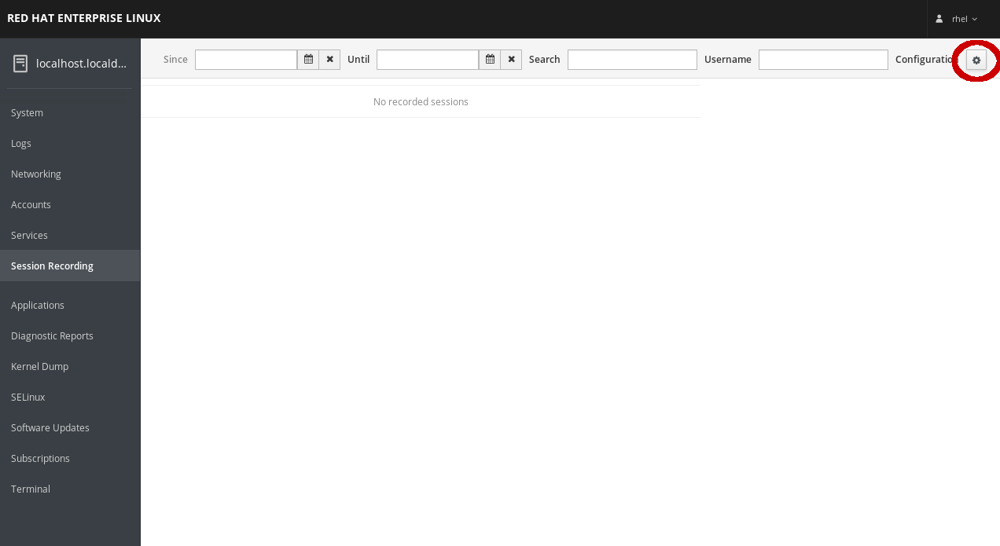
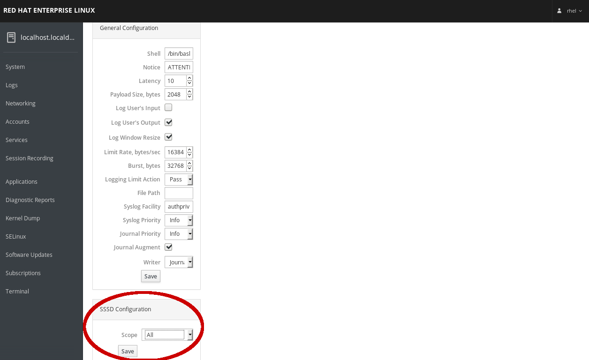
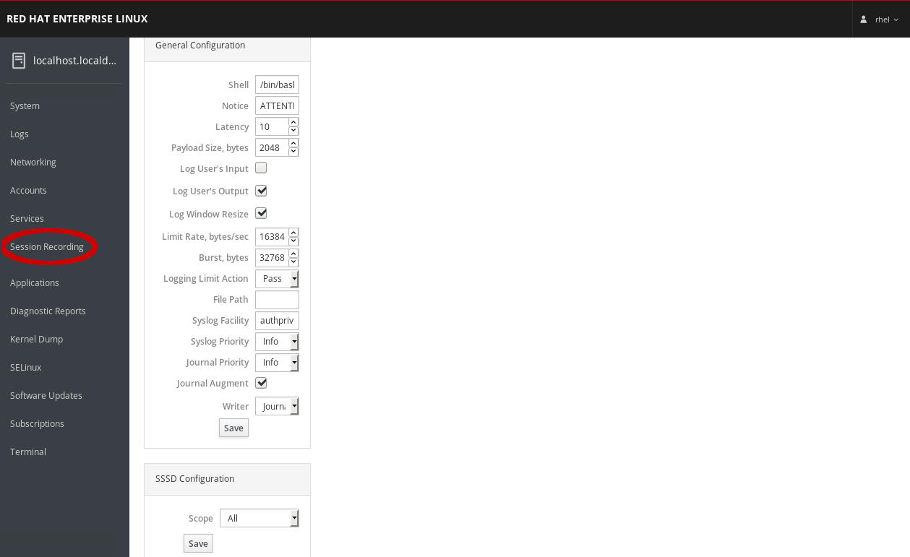

## Configuring and enabling session recording

The *Session Recording* application is initially blank, reporting
__No recorded sessions__.  Click the *gear icon* in the upper right-hand
corner to be taken to the configuration settings for session recording.

On the resulting page, you will be offered access to configuration information
for session recording.  For the purpose of this scenario, you will accept most
of the defaults and under the __SSSD Configuration__ section at the bottom of
the page, select the *Scope* of *All*, which will apply session recording
to all users and groups that open sessions on the system.

Once you click the *Save* button, Web Console will write out a small
configuration file detailing the scope for the sssd daemon.

After saving the configuration, return the Web Console to the main *Session
Recording* page.

