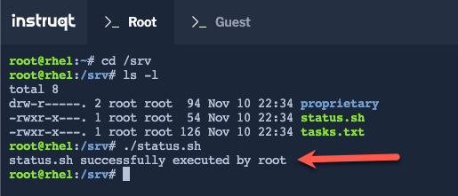

Recall from the previous step that __status.sh__ has the following permissions:

<pre class=file>
-rwxr-x---
</pre>

Therefore, __root__ has permission to execute this script. Run the script by copying and pasting the following into the terminal window.

```bash
./status.sh
```



Let's focus on the permissions of `status.sh`.

<a href="#1">
 
</a>

<a href="#" class="lightbox" id="1">
 
</a>

The first three letters of the access mode show that the owner of the file has full permissions, __rwx__, so the owner can read, write, and execute this file. See the image below.

<a href="#2">
 
</a>

<a href="#" class="lightbox" id="2">
 
</a>

Users in the group that owns this file have __r-x__, so they can read and execute but cannot write to this file. See the image below.

<a href="#3">
 
</a>

<a href="#" class="lightbox" id="3">
 
</a>

Finally, all other users have no permissions, __---__, so they are unable to read, write, or execute this file.

<a href="#4">
 
</a>

<a href="#" class="lightbox" id="4">
 
</a>


Switch to the `Guest` tab and traverse into the `/srv` directory.

```bash
cd /srv
```


Try executing the status script as __guest__. Since the guest account is not the user owner of the file and is not part of any owner groups, you are unable to execute this script from this user account.

```bash
./status.sh
```


Now that you know how files behave differently when operated on by different user accounts, the next steps will show you how to customize permissions to control this behavior.

<style>
.lightbox {
  display: none;
  position: fixed;
  justify-content: center;
  align-items: center;
  z-index: 999;
  top: 0;
  left: 0;
  right: 0;
  bottom: 0;
  padding: 1rem;
  background: rgba(0, 0, 0, 0.8);
}

.lightbox:target {
  display: flex;
}

.lightbox img {
  max-height: 100%;
}
</style>
