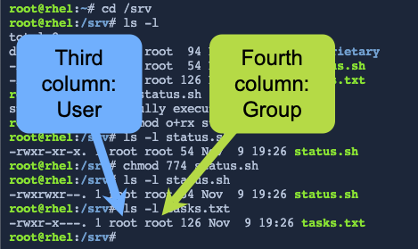

From the **Root tab** confirm that __root__ is the initial owner of the file __tasks.txt__:

```bash
ls -l tasks.txt
```

<pre class=file>
-rwxr-x---. 1 root root 117 Jun  2 23:01 tasks.txt
</pre>

The third and fourth column of this output are the user and group that own the file. Right now, __root__ is the owner in both cases.



Switch to the guest terminal in the bottom pane and attempt to read the file:

```bash
cat tasks.txt
```

<pre class=file>
cat: tasks.txt: Permission denied
</pre>

This read operation is denied, as __guest__ does not have read permission.

Return to the **Root tab**.

Change the user that owns __tasks.txt__ to __guest__:

```bash
chown guest tasks.txt
```

Return to the **Guest tab**.

Run the following command.

```bash
ls -l tasks.txt
```

<pre class=file>
-rwxr-x---. 1 guest root 117 Jun  2 23:01 tasks.txt
</pre>

Now that __guest__ owns the file instead of __root__, this user has permission to read the file without reconfiguring the access modes.

```bash
cat tasks.txt
```

<pre class=file>
1. Finish this Permissions Lab
2. Do the Networking Configuration Basics Lab
3. Listen to the latest episode of RHEL Presents
</pre>

The fourth column of the `ls -l` output is the group which owns the file. The next step will walk you through changing group ownership.
