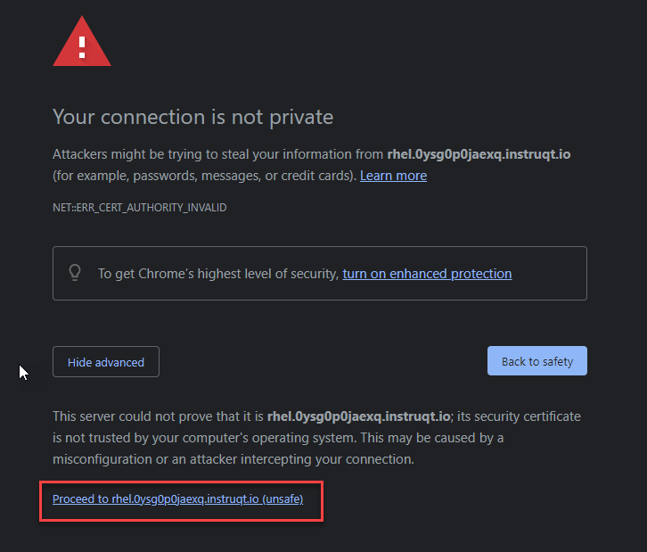

Click on the tab titled **RHEL Web Console** at the top of  your lab system interface. Selecting this tab will open the lab system's Web Console in a
new browser tab or window.


Click `Advanced`


Then click `Proceed to rhel.xxxx.instruqt.io`



Once the login page is presented, use the following credentials to log into the Web Console:

1 - Username:

```bash
rhel
```

2 - Password:

```bash
redhat
```

<a href="#login">
 
</a>

<a href="#" class="lightbox" id="login">
 
</a>

<style>
.lightbox {
  display: none;
  position: fixed;
  justify-content: center;
  align-items: center;
  z-index: 999;
  top: 0;
  left: 0;
  right: 0;
  bottom: 0;
  padding: 1rem;
  background: rgba(0, 0, 0, 0.8);
}

.lightbox:target {
  display: flex;
}

.lightbox img {
  max-height: 100%;
}
</style>
